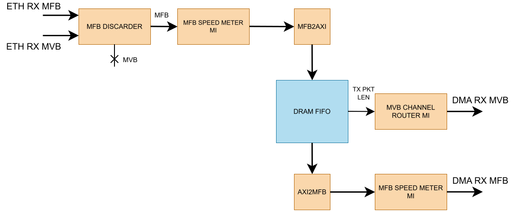
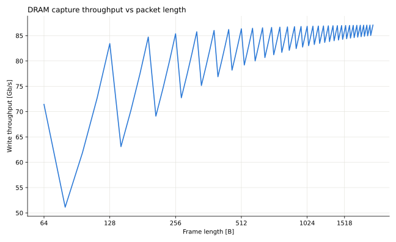

.. _ndk_app_dram_pkt_capture:

DRAM Packet Capture application
===============================

The DRAM Packet Capture application buffers incoming network packets in external
DDR memory before forwarding them to the host over DMA. It decouples the capture
rate from the rate at which software can drain packets.

The application contains one independent APP
subcore per Ethernet stream. The Ethernet and DMA streams use the
:ref:`MFB buses <mfb_bus>` and :ref:`MVB buses <mvb_bus>`.

Architecture
------------

Each APP subcore contains one independent capture pipeline. Capture is gated by
a software-controlled enable bit, so the datapath only accepts packets when the
host has armed it.

RX direction (Ethernet to DMA)
******************************

.. warning::
    This is a simplified diagram of one subcore.
    Check each bullet point for full explanation of each block.

|

- **MFB DISCARDER** discards incoming traffic based on ``capture_enable`` (accesable via MI).
  The Ethernet MVB headers are consumed here and do not travel further downstream.
  They are reconstructed downstream instead to avoid extra metadata entering the DRAM.

- **MFB SPEED METER MI** is used to measure throughput on the write side of each subcore.
  A second instance measures the read (drain) side. Both are reachable over MI at fixed
  offsets from the subcore base — ``0x1000`` for the RX (write) meter and ``0x2000`` for the TX (drain)
  meter — and appear in the Device Tree as the ``rx_speed_meter`` and ``tx_speed_meter``
  subnodes of the app core, with compatible string ``cesnet,ofm,speed_meter``.
  Example usage can be seen in ``scripts/len_throughput_test.py``

  .. note::
      That compatible string is not unique to this application: every
      :ref:`Gen Loop Switch <gls_debug>` instance carries four meters using the same
      string, and GLS is enabled by default. Resolving a meter by its global index can
      therefore silently return the wrong one — look the meters up as subnodes of the
      ``cesnet,dram_pkt_capture,app_core`` node instead.

- **MFB2AXI** and **AXI2MFB** convert between the NDK's MFB bus and the AXI-Stream
  interface that :ref:`DRAM FIFO <dram_fifo>` uses on both its write and read ports.

- :ref:`DRAM FIFO <dram_fifo>` stores data beats in an internal FIFO, until a metaword
  is created. The metaword alongside with the corresponding data is captured in an
  external DDR4 memory over the
  :ref:`memory interface <dram_pkt_capture_mem_interface>`.

- **MVB CHANNEL ROUTER MI** is used in sync with other logic inside of the subcore to recreate the MVB bus signals based on
  packet length provided by DRAM FIFO

  The MVB header carrying the packet length and target DMA channel is generated
  from ``TX_PKT_LEN`` on the first payload beat leaving the DRAM FIFO, and is held
  until the DMA accepts it.

``STREAMING_DEBUG_PROBE_MFB`` probes are inserted before ``MFB2AXI`` and after
``AXI2MFB``, both reachable through the debug master at MI offset ``0x3000``.

TX direction (DMA to Ethernet)
******************************

The TX path is a straight pass-through with no DRAM buffering: a debug probe, a
``METADATA_INSERTOR`` that attaches the Ethernet TX header, and an ``MFB_PIPE``.

Flow control
************

``DDR_FULL`` is asserted when the ring cannot accept another write. The subcore
uses it to clear ``capture_enable`` automatically, so capture stops cleanly
rather than corrupting the ring. Reading is gated separately by ``DDR_READ_EN``.

Because ``capture_enable`` is cleared by hardware on ``dram_full``, reading it
back is the reliable way to tell whether capture is still running rather than
assuming the last write still holds.

The register map is defined once, in ``scripts/dram_pkt_capture_regs.py``. The
scripts and the top-level cocotb test import it from there; use it the same way
in your own tools:

.. code-block:: python

    import nfb
    from dram_pkt_capture_regs import AppStatus

    dev = nfb.open()
    st = AppStatus(dev=dev, index=0)    # app core 0
    st.set_capture_enable(True)
    while st.capture_enable:            # cleared by hardware on dram_full
        pass
    st.set_read_enable(True)            # drain the DRAM towards DMA

Run it from ``scripts/``, or add that directory to ``PYTHONPATH``.

The same registers can be poked from the command line with ``nfb-bus``, using the
addresses reported by ``nfb-bus -l`` for the ``app_status`` node of the core you
want.

The app_status register block
*****************************

Device tree compatible string: ``cesnet,dram_pkt_capture,app_status``.

.. list-table::
    :header-rows: 1
    :widths: 12 10 18 60

    * - Offset
      - Bit
      - Access
      - Description
    * - ``0x00``
      - 0
      - RO
      - ``dram_full`` — the DRAM ring buffer is full.
    * - ``0x04``
      - 0
      - RW
      - ``capture_enable`` — admit packets into the DRAM FIFO. Cleared by
        hardware when ``dram_full`` is asserted.
    * - ``0x08``
      - 0
      - RW
      - ``read_enable`` — drain packets from the DRAM FIFO towards DMA.

A typical capture cycle is: set ``capture_enable``, wait for ``dram_full`` (or
stop manually), clear ``capture_enable``, then set ``read_enable`` to drain the
buffer to the host.

You can test flow control with the following script: ``scripts/throughput_test.py``

Edge cases
**********

- **Capture and read enabled at the same time.** This is allowed, but the
  DRAM FIFO gives writes priority on the shared memory port: a read is issued
  only in cycles with no pending write. Under heavy incoming traffic the drain
  slows down or stops until the traffic eases or ``capture_enable`` is cleared.
- **Packets already on chip when** ``capture_enable`` **is cleared.** Clearing
  it only makes the discarder drop new packets. Packets that already passed the
  discarder are still written to DRAM and can be read out. Their lengths are
  stored in a shared metaword that is written only when it is full or after
  ``FLUSH_TIMEOUT`` (1024) cycles without a new packet, so the last few packets
  reach DRAM, and become readable, with that delay.
- ``capture_enable`` **does not re-arm itself.** After ``dram_full`` clears it,
  it stays ``0`` even once reading has freed space. Software must set it again.
  A write of ``1`` while ``dram_full`` is still asserted is overridden in the
  next cycle, so read the register back to confirm capture is running.
- **Starting a new capture before the buffer is drained.** The ring pointers
  are cleared only by reset. Neither ``capture_enable`` nor ``read_enable``
  touches them. The ring is a FIFO, so the remaining packets from the previous
  capture are read out first, followed by the new ones. To start with an empty
  buffer, drain it completely (or reset the design) before enabling capture.

.. _dram_pkt_capture_mem_interface:

Memory interface
----------------

Each subcore uses ``MEM_PORTS_USED`` Avalon-MM ports (default ``2``) of
``MEM_DATA_WIDTH`` bits each (default ``256``). The two ports are ganged into a
single ``INT_DATA_WIDTH`` = 512-bit interface, with reads and writes issued to
both ports in lockstep, an ``accepted`` register pairs up the two ``ardy``
responses so a transfer only advances once both ports have taken it.

On the :ref:`n6010 <card_n6010>` with ``MEM_PORTS = 4``, this gives two
subcores with two DDR4 channels each.

Memory target selection
***********************

``application_core.vhd`` selects where the AVMM traffic goes:

.. code-block:: vhdl

    type     mem_target_t is (MEM_TGT_BRAM, MEM_TGT_EXT_DDR);
    constant MEM_TARGET : mem_target_t := MEM_TGT_EXT_DDR;

``MEM_TGT_BRAM``
    Instantiates ``AVMM_BRAM`` as an on-chip memory model. **Required for
    simulation** — the card's DDR4 controllers are not bound in simulation.

``MEM_TGT_EXT_DDR``
    Connects to the card's external memory controllers. **Required for a
    bitstream.**

.. warning::
    This constant is edited by hand and must be switched when moving between
    simulation and synthesis. Building a bitstream with ``MEM_TGT_BRAM`` gives a
    design with no external memory. Running the top-level simulation with
    ``MEM_TGT_EXT_DDR`` leaves the AVMM interface connected to unbound components
    and the simulation will not work.

The ring depth follows ``MEM_TARGET`` automatically, so switching target is the
only edit needed:

.. code-block:: vhdl

    constant BRAM_ADDR_WIDTH : natural := 13;
    constant RING_ADDR_WIDTH : natural :=
        tsel(MEM_TARGET = MEM_TGT_BRAM, BRAM_ADDR_WIDTH, MEM_ADDR_WIDTH);

``RING_ADDR_WIDTH`` is passed to the subcore and sets ``DRAM_FIFO``'s
``FIFO_ITEMS`` to ``2**RING_ADDR_WIDTH``. It is deliberately separate from
``MEM_ADDR_WIDTH``, which stays at the card's value (``27`` on the n6010) as the
width of the AVMM address bus. In the BRAM configuration ``BRAM_ADDR_WIDTH``
alone drives the ``AVMM_BRAM`` depth, the ``resize()`` at its address port and
the ring depth, so resizing the simulation memory is a one-line change.

.. note::
    The ring must never be deeper than the memory behind it. The AVMM address is
    truncated with ``resize()`` at the BRAM port, so an oversized ring aliases
    onto itself and silently overwrites unread data. The symptom is complete loss
    of packet framing, which looks like an RTL bug but is not. The derivation
    above prevents this as long as ``BRAM_ADDR_WIDTH`` matches the memory model.

The application MI offsets
--------------------------

The application MI space is split between the APP subcores. Each subcore gets a
sub-window whose width is derived from the number of Ethernet streams rounded up
to a power of two. Within it, the layout is fixed:

.. list-table::
    :header-rows: 1
    :widths: 20 80

    * - Offset
      - Block
    * - ``0x0000``
      - ``MVB_CHANNEL_ROUTER_MI`` — DMA channel assignment on the drain side
    * - ``0x1000``
      - ``MFB_SPEED_METER_MI`` — RX (capture side) throughput counters
    * - ``0x2000``
      - ``MFB_SPEED_METER_MI`` — TX (drain side) throughput counters
    * - ``0x3000``
      - ``STREAMING_DEBUG_MASTER`` — three debug probes
    * - ``0x4000``
      - ``app_status`` — capture control and status

The full map is described by the DevTree and can be listed from the card with
``nfb-bus -l``, application nodes appear under
``/firmware/mi_pci0_bar0/application/*``.

Build
-----

Only the :ref:`n6010 <card_n6010>` build target is provided:

.. code-block:: bash

    cd apps/dram_pkt_capture/build/n6010
    make 100g2

The entire application can be simulated. See :ref:`dram_pkt_capture_tls`.

Throughput measurement
----------------------

Two scripts read the speed meters over MI on a running card:

.. note::
    These scripts need the ``nfb`` and ``ofm`` Python packages.

``scripts/throughput_test.py``
    Samples RX and TX throughput continuously and prints a live figure, with
    interactive control of the capture and read enable bits.

``scripts/len_throughput_test.py``
    Sweeps the transmitted packet length and records throughput per length,
    producing a CSV and a plot.

    .. note::
      When using this script the -s, --frame-size argument MAX cannot exceed 16316 B,
      otherwise GLS stops creating traffic.

The graph below was measured under these conditions:

- **Traffic source:** the Gen Loop Switch generator of the measured core. Frames
  go out through the Ethernet TX MAC and come back through PMA local loopback,
  so the offered load is the 100 Gb/s line rate for the given frame length.
- **One core at a time:** only core 0 (one 100G port) was measured. The other
  core received no traffic.
- **Write only:** ``read_enable`` was ``0`` while measuring, so the memory port
  served only writes. Between lengths the DRAM was drained with
  ``read_enable = 1`` so every length started with an empty buffer.
- **Measured value:** the RX (capture side) speed meter, averaged over 4
  windows of 84 ms. Windows without traffic, e.g. the one in which
  ``dram_full`` stopped capture, are left out.
- **Frame length** on the X axis includes the 4 B FCS. The sweep runs from
  64 B to 2048 B. The last labelled tick is 1518 B.

    Capture (DRAM write) throughput against frame length on the
    :ref:`n6010 <card_n6010>`, measured with ``len_throughput_test.py``.
    Drain (read) throughput is not shown.

Two properties of the design shape the curve:

**Single-word DDR accesses.** Every DDR transaction carries one 512-bit word
(two 256-bit memory ports side by side). ``AVMM_BURSTCOUNT`` is fixed to ``1``.
The memory controller therefore receives a separate command for every word and
cannot use longer bursts. This is the most likely reason the write side levels
off at about 87 Gb/s for large frames, below the 102 Gb/s the application clock
allows (200 MHz × 512 b).

**Word-aligned packets.** Every packet starts at the beginning of a new 64 B
word, so a packet of *L* bytes occupies ``ceil(L/64)`` words in DRAM and on the
internal bus. When *L* is just above a multiple of 64 B, the last word is
mostly empty and throughput drops. For example, an 80 B frame takes two words
(128 B), so only 62.5 % of the bandwidth carries payload. 1040 B and 1488 B
frames waste 48 B of their last word as well. These are the dips in the graph.

**Drain (read) throughput** is not part of the graph and has its own limit.
Reads are single words as well, and each memory port allows at most 16 reads
in flight: ``MAX_OUTSTANDING`` in ``app_subcore.vhd`` and the fixed depth of
the ``MI_ASYNC`` clock-domain crossing. A read holds its slot for the whole
round trip into the memory clock domain, through the memory controller and
back, so the drain rate is at most ``16 / round-trip latency`` words per
clock. Once the round trip exceeds 16 cycles, the drain is slower than
capture.

Supported cards
----------------
:ref:`n6010 <card_n6010>`

.. toctree::
    :maxdepth: 1
    :caption: Content:

    comp/dram_fifo/readme
    tests/cocotb/readme
