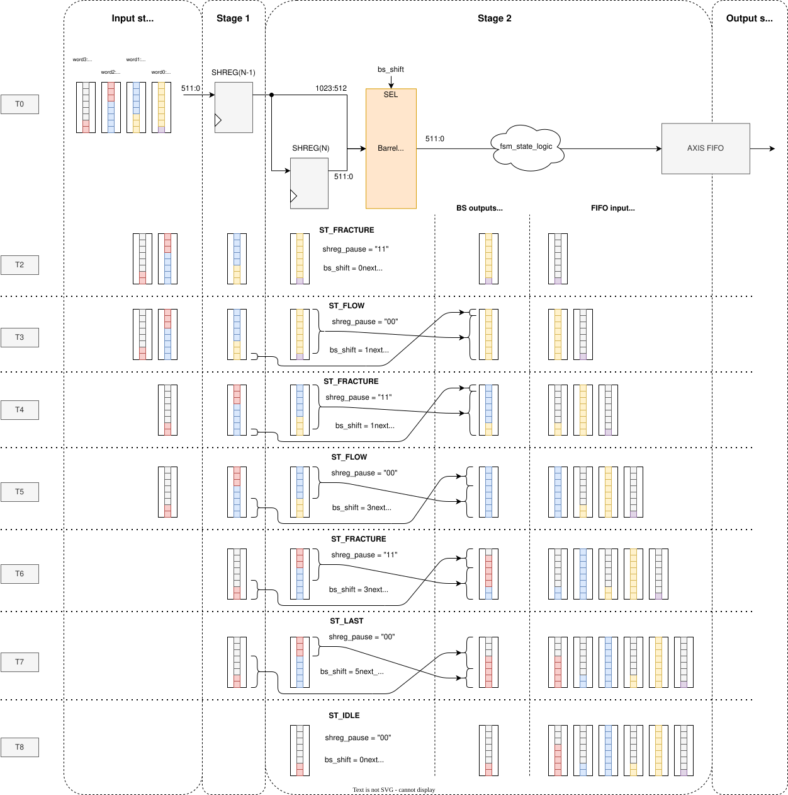
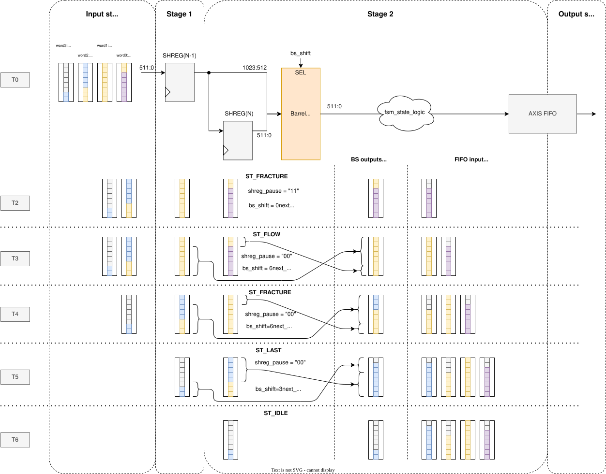
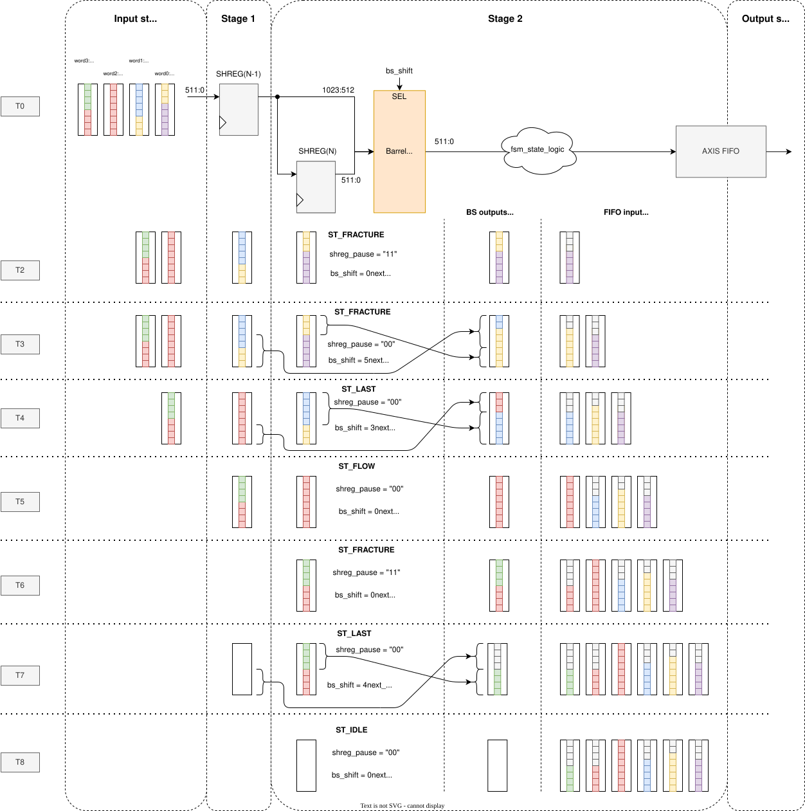

.. Copyright (C) 2025 CESNET z. s. p. o.
.. Author(s): Daniel Kondys <kondys@cesnet.cz>
.. SPDX-License-Identifier: BSD-3-Clause

.. _axis_frame_fracturer:

AxiS Frame Fracturer
=====================

.. vhdl:autoentity:: AXIS_FRAME_FRACTURER

.. _axis_frfr_diagrams_and_notes:

Diagrams and notes
------------------

The following diagrams illustrate various example scenarios of frame breaking.
Sadly, due to the complexity of the component, not all possible scenarios are covered here (e.g., WAIT state transitions).
Points to note:

- In the present state, the logic of the current state takes into account the word limited by the current shift signal (`bs_shift`).
- In the next state, the logic considers the word limited by the next shift signal (`bs_shift_next`).
  It also takes into account the current stage (`stg`) as, e.g., breaking in the top-most stage, requires the FSM to look at the top and second-top stages, while in some other cases (like FLOW), it needs to look further into the future.
- The Pause is issued only in the FRACTURE state and only when the breaking occurs in the top-most stage of the shift register.

In the 1st example below, a Fracture is set for each word (except the last).
However, note how the present state switches between FLOW and FRACTURE states, rather than being only in the FRACTURE state.
A scenario where the present state remains in the FRACTURE state for two cycles is shown in the :ref:`3rd example <axis_frfr_schematic3>`.

.. _axis_frfr_schematic:

    Example 1: A single packet with Fracture in each word

The 2nd example doesn't issue a Fracture in the 2nd word, however, note how the state sequence switches between the FLOW and FRACTURE states very much like in the 1st example.
Also, note how when the last valid word arrives at the top-most stage, the output is invalid.
That is due to the present state already being in the IDLE state as this part of the packet has been sent in the previous cycle.
Just another thing to take into account when messing with the state transition logic.

.. _axis_frfr_schematic2:

    Example 2: A single packet with no Fracture in the 2nd word

The 3rd example displays a scenario of two packets following one right after another.
It also shows how a word with the end of the packet (TLAST) also has a fracture in it.
This results in a different TX_TKEEP calculation (signals `keep_msb_idx` -> `bs_tx_axi_tkeep`).
A situation not shown—and which could occur—is with a break in the last word of the packet where the end is also seen by the next state logic.
It would occur if the first packet ended on the 3rd item (RX_TKEEP = "11110000") or 4th (RX_TKEEP = "11111000").
However, this is only important for state transition logic—TX_TKEEP calculation is the same.

.. _axis_frfr_schematic3:

    Example 3: Two packets with fractures in the last word
