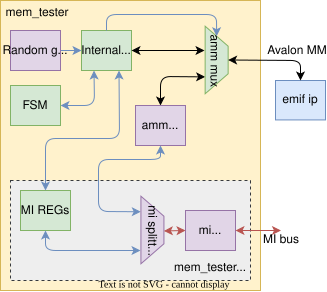

.. _mem_tester:

Memory Tester
-------------

The ``MEM_TESTER`` component is used to test external DDR memory.
It detects hardware failures and measures the overall performance of the memory.

Key Features
^^^^^^^^^^^^

* **Interface Compatibility**
  Compatible with the Avalon Memory-Mapped (**AMM**) interface and Intel EMIF Hard IP.

* **Basic Test Workflow**

  1. Sequentially writes pseudo-random data to every memory address.
  2. Resets the pseudo-random generator (to reproduce the exact same sequence).
  3. Sequentially reads back from all addresses and compares the received data with the expected values.

* **Random Addressing Mode** (optional)

  * Generates random addresses to simulate more realistic memory access patterns and measure performance.

.. warning::
    Random Addressing Mode is **not suitable for error detection (address overlaps can cause false error reports).**
    Use it **only for performance measurement**, not for memory testing.

* **Additional Configurable Options**

  * **Incremental Read mode:** The next read request is issued only after the previous one completes.
    Ideal for precise latency measurements because the memory is not loaded with concurrent requests.
  * **Auto precharge** support (for random addressing).
  * Manual control of the memory **refresh period**.

* **Configuration & Control**
  All test parameters are configured via the MI bus.

* **Reporting**
  Includes a Python script that generates PDF performance reports.

* **Measurement Logging**
  Handled by the :ref:`MEM_LOGGER <mem_logger>` component.

* **Clock Domain**
  Must be instantiated in the **external memory controller’s clock domain**.

  * The MI bus is automatically bridged using the internal ``MI_ASYNC`` component.

* **Manual Memory Access**
  You can also perform manual read/write operations on the memory using the :ref:`AMM_GEN <amm_gen>` component.

Component port and generics description
^^^^^^^^^^^^^^^^^^^^^^^^^^^^^^^^^^^^^^^

.. vhdl:autoentity:: MEM_TESTER
   :noautogenerics:

.. _mem_tester_sw:

Control Software
^^^^^^^^^^^^^^^^

**Requirements**

* **NFB python package**

  * See: `ndk-sw <https://github.com/CESNET/ndk-sw?tab=readme-ov-file>`_

* **Open FPGA Modules python package**

  * It includes packages for ``DATA_LOGGER`` and ``MEM_LOGGER``.
  * See: `ndk-fpga/python/ofm <https://github.com/CESNET/ndk-fpga/tree/devel/python/ofm>`_

**Basic usage of** ``mem_tester.py``

* No arguments          ... Run basic **sequential memory test** and show result
* ``-p``                ... Print current state of ``MEM_TESTER``
* ``-r``                ... Run test with **random addressing** (performance only)
* ``-d <device>``       ... Specify NFB device (default: ``/dev/nfb0``)
* ``-i <index>``        ... Specify ``MEM_TESTER`` instance (also applies to ``MEM_LOGGER``)
* ``--gen-*``           ... Manual read/write access to memory via ``AMM_GEN``

**Example output** (with no arguments)

.. code-block::

    || ------------------- ||
    || TEST WAS SUCCESSFUL ||
    || ------------------- ||

    Mem_logger statistics:
    ----------------------
    write requests       16777215
    write words          67108860
    read requests        16777215
    ...
    Flow:
    write                137.03 [Gb/s]
    read                  24.66 [Gb/s]
    total                 41.80 [Gb/s]
    Latency:
    min                   75.00 [ns]
    max                  630.00 [ns]
    avg                   80.04 [ns]
    Errors:
    zero burst count     0
    simultaneous r+w     0

**Full usage of** ``mem_tester.py``

.. code-block::

  $ python sw/mem_tester.py -h
  usage: mem_tester.py [-h] [-d device] [-c compatible] [-C compatible]
                      [-i index] [-I index] [-p] [--rst] [--rst-tester]
                      [--rst-logger] [--rst-emif] [-r] [-b BURST] [-s SCALE]
                      [-o] [-f] [--auto-precharge] [--refresh REFRESH]
                      [--set-buff burst data] [--get-buff] [--gen-wr addr]
                      [--gen-rd addr] [--gen-burst GEN_BURST]

  mem_tester control script

  optional arguments:
    -h, --help            show this help message and exit

  card access arguments:
    -d device, --device device
                          device with target FPGA card.
    -c compatible, --comp compatible
                          mem_tester compatible inside DevTree.
    -C compatible, --logger-comp compatible
                          mem_logger compatible inside DevTree.
    -i index, --index index
                          mem_tester index inside DevTree.
    -I index, --logger-index index
                          mem_logger index inside DevTree.

  common arguments:
    -p, --print           print registers
    --rst                 reset mem_tester and mem_logger
    --rst-tester          reset mem_tester
    --rst-logger          reset mem_logger
    --rst-emif            reset memory driver

  test related arguments:
    -r, --rand            use random indexing during test
    -b BURST, --burst BURST
                          burst count during test
    -s SCALE, --scale SCALE
                          tested address space (1.0 = whole)
    -o, --one-simult      use only one simultaneous read during test
    -f, --to-first        measure latency to the first received word
    --auto-precharge      use auto precharge during test
    --refresh REFRESH     set refresh period in ticks

  amm_gen control arguments:
    --set-buff burst data
                          set specific burst data in amm_gen buffer
    --get-buff            print amm_gen buffer
    --gen-wr addr         writes amm_gen buffer to specific address
    --gen-rd addr         reads memory data to amm_gen buffer
    --gen-burst GEN_BURST
                          sets burst count for amm_gen

Pytest Automated Testing
^^^^^^^^^^^^^^^^^^^^^^^^

You can run fully automated tests with **pytest**:

.. code-block:: bash

    pip install pytest
    python -m pytest -xs --tb=short test_mem_tester.py

**Useful flags:**

* ``-s``          ... show measured data
* ``-x``          ... stop after first failure
* ``--tb=short``  ... show only assertion messages

The script automatically finds all ``MEM_TESTER`` and ``MEM_LOGGER`` instances and runs sequential tests with minimal and maximal burst counts.

To use a different device, edit the ``device`` variable in ``test_mem_tester.py``.

PDF Report Generator
^^^^^^^^^^^^^^^^^^^^

The ``report_gen.py`` script runs the ``MEM_TESTER`` with many different configurations and creates a PDF (or Markdown) report with plots.

**Report content:**

* Basic configuration of ``MEM_TESTER`` and ``MEM_LOGGER``
* Full memory test results for every interface
* Tables and plots with latencies, bandwidth, etc.

**Requirements for PDF output:**

.. code-block:: bash

    sudo yum install pandoc texlive-latex texlive

**Generate report:**

.. code-block:: bash

    python report_gen.py          # Markdown + PDF report
    python report_gen.py md       # Markdown only

**Files created:**

* ``mem_tester_report.md`` and ``mem_tester_report.pdf`` with plots
* Plots: ``fig/`` folder
* Raw data: ``data.npz``

Internal Architecture
^^^^^^^^^^^^^^^^^^^^^

* MI bus logic is in a separate file: ``mem_tester_mi.vhd``

  * :ref:`MI_ASYNC <mi_async>` bridges MI bus and Avalon clock domains
  * :ref:`MI_SPLITTER_PLUS_GEN <mi_splitter_plus_gen>` splits the bus for ``MEM_TESTER`` and ``AMM_GEN``

* :ref:`AMM_GEN <amm_gen>` enables manual memory access
* Random data/addresses are generated by ``LFSR_SIMPLE_RANDOM_GEN``
* ``AMM_MUX`` selects between test logic and manual access
* Everything is controlled by a FSM

Manual MI Bus Control
^^^^^^^^^^^^^^^^^^^^^

**Register map**

.. list-table::
   :header-rows: 1
   :widths: 15 30 55

   * - Address
     - Name
     - Description
   * - 0x0000
     - ctrl_in
     - Control register (bits below)
   * - 0x0004
     - ctrl_out
     - Status register
   * - 0x0008
     - err_cnt
     - Error counter
   * - 0x000C
     - burst_cnt
     - Burst length used in test
   * - 0x0010
     - limit_addr
     - Tested address space limit
   * - 0x0014
     - refresh_period
     - Current refresh period
   * - 0x0018
     - default_refresh
     - Default refresh period
   * - 0x0040
     - AMM_GEN base
     - Base address for manual access

**ctrl_in bits (write only, rising-edge triggered for reset/run):**

* bit 0 ... reset
* bit 1 ... reset EMIF IP
* bit 2 ... run test
* bit 3 ... enable AMM_GEN
* bit 4 ... random addressing
* bit 5 ... one simultaneous read only (latency measurement)
* bit 6 ... auto precharge

**ctrl_out bits (read):**

* bit 0 ... test done
* bit 1 ... test successful
* bit 2 ... ECC error
* bit 3 ... calibration success
* bit 4 ... calibration fail
* bit 5 ... AMM_READY

**Usage**

Reset sequence:

* Set ``reset`` bit to ``1`` and then to ``0``
* To reset EMIF IP set ``reset EMIF IP`` bit to ``1`` and then to ``0`` and
  wait for either ``calibration successful`` bit or ``calibration fail`` bit

Run test:

* To run the test set ``run test`` bit to ``1``
* After the test is finished ``test done`` bit will be set to ``1`` and the result will be available in ``test successful`` bit
* Error count during test will be available inside err cnt register

Sub-components
^^^^^^^^^^^^^^
.. toctree::
    :maxdepth: 1

    amm_gen/readme
    amm_probe/readme
    sw/readme

