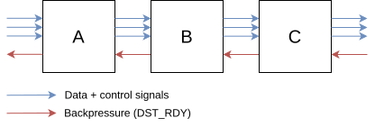
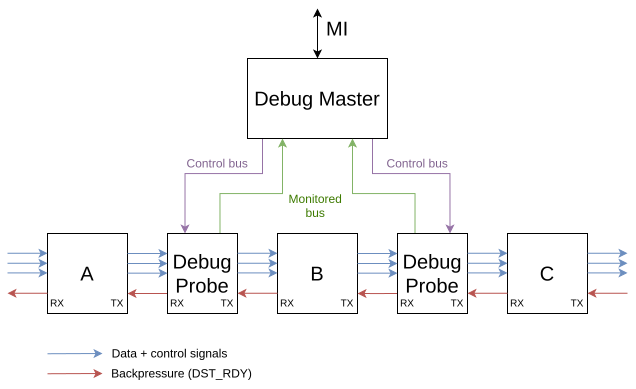
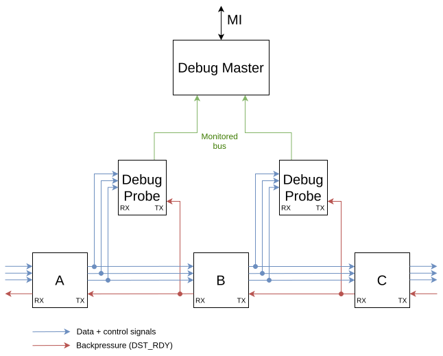

.. _streaming_debug:

Streaming Debug
===============

This component is useful for debugging streaming buses (typically :ref:`MFB <mfb_bus>` and :ref:`MVB <mvb_bus>` in the NDK).
It can count the number of processed words and packets and indicate a bottleneck where the throughput is being decreased.

The whole Streaming Debug system consists of two parts: STREAMING_DEBUG_MASTER and STREAMING_DEBUG_PROBE.
Furthermore, the Probe has three versions:

- classic (entity STREAMING_DEBUG_PROBE)
- inverted [#f1]_ (entity STREAMING_DEBUG_PROBE_N)
- MFB (entity STREAMING_DEBUG_PROBE_MFB); often also used for MVB

The Debug Probes are usually placed between two neighboring components in a stream pipeline.
For example, imagine a pipeline consisting of components A --> B --> C, as in the following figure.

.. _figure1:

    An example of a stream pipeline where component A sends data to comp B (and B to C) and where B uses backpressure (DST_RDY) to pause data from A (and C to B).

In this case, Probes can be placed between the components as well as on the beginning and end of the pipeline.
All Probes should be connected to the same Debug Master (for simplicity and saving FPGA resources).
This is displayed in the following diagram.

.. _figure2:

    A pipeline with integrated Debug Probes and Master.
    Control signals such as Data Valid (SRC_RDY), Start-Of-Packet (SOP), End-Of-Packet (EOP), and backpressure (DST_RDY) all flow through the Probe.
    This is the intended manner in which the probes should be integrated into a design to use all of its features.
    Also, the "Bus Control" (see section :ref:`bus_control`) signals are connected from the Master to the Probe.

However, we often do not need to use features to stop (block) or discard (drop) the flowing traffic.
In that case, the "Bus Control" signals and some other connections can be omitted.
The typical connection of the Debug Probes is shown in the following diagram.

.. _figure3:

    Common connection of the Probes in the NDK designs - Bus Control is not used (see section :ref:`bus_control`).

Debug Master
------------

The Debug Master component is connected to the MI bus and one or more Probes.
It accepts commands through the MI bus to control the Probes or read statistical data.
The module contains counters that increment according to signals received from each Probe (one counter - of each type - per Probe).

Counters
~~~~~~~~

Six types of counters are available in the Debug Master for each Debug Probe.
Each can be disabled/enabled by generic parameters: "E" or "e" to "enable"; anything else will translate as "disable".

- `COUNTER_WORD`: number of valid data words - clock cycles when both SRC_RDY and DST_RDY were asserted.
- `COUNTER_WAIT`: number of clock cycles when neither SRC_RDY nor DST_RDY were asserted.
- `COUNTER_DST_HOLD`: number of clock cycles when SRC_RDY was asserted and DST_RDY deasserted (the next component in the pipeline could not process new data).
- `COUNTER_SRC_HOLD`: number of clock cycles when SRC_RDY was deasserted and DST_RDY asserted (the previous component in the pipeline did not output valid data).
- `COUNTER_SOP`: number of transaction starts (valid SOPs/SOFs).
- `COUNTER_EOP`: number of transaction ends (valid SOPs/SOFs).

Debug Probes
------------

Each Probe has three interfaces:

- `RX` - connect signals on the interface of the previous component in the pipeline.
  In the A --> B --> C example at the top, this would be the output (TX) interface of component **A** for Probe placed between comps **A** and **B**.
- `TX` - connect signals on the interface of the next component in the pipeline.
  In the A --> B --> C example at the top, this would be the input (RX) interface of component **B** for Probe placed between comps **A** and **B**.
- `DEBUG` - connect to the Master's `DEBUG` interface.

See Probe connections in the :ref:`second diagram <figure2>` (or the :ref:`third <figure3>`).

**The Debug interface**

When Bus Control is enabled, the `BLOCK` and `DROP` signals can modify the traffic flow (see the following section).
Other signals on this interface are the monitored signals from the Probe that increment the Master's counters.

Each Probe is identified by:

- four-letter user-defined string (generic parameter of the component),
- an automatically assigned ID (port number on which it is connected to the Master)

.. _bus_control:

Bus control
-----------

When this "advanced" feature is enabled, the user can halt or discard the traffic flowing through a selected Probe.
To utilize this feature, the Probe must be inserted into the pipeline as shown in the :ref:`second diagram <figure2>`.
And for each Probe, it has to be enabled using the `BUS_CONTROL` generic parameter.
Appropriate MI commands to Debug Master are translated to the `DEBUG_BLOCK` and `DEBUG_DROP` interface signals.
This sets the requested Probe to:

- Halt the traffic (when the `DEBUG_BLOCK` signal asserts).
  The Probe then pauses the incoming traffic by deasserting `RX_DST_RDY` and invalidating the output by deasserting `TX_SRC_RDY`.
- Discard the traffic (when the `DEBUG_DROP` signal asserts; has priority over the `DEBUG_BLOCK` signal).
  The Probe accepts all incoming traffic by asserting `RX_DST_RDY` and invalidate the output by deasserting `TX_SRC_RDY`.

.. _usage:

Usage
-----

Use the `nfb-busdebugctl` tool for easy control of the whole Streaming Debug system.
For more info, see the tool's documentation.

Entities
--------

.. vhdl:autoentity:: STREAMING_DEBUG_MASTER

.. vhdl:autoentity:: STREAMING_DEBUG_PROBE_MFB

.. rubric:: Footnotes

.. [#f1] The monitored signals are expected to be negated.

