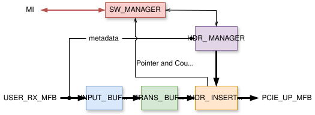
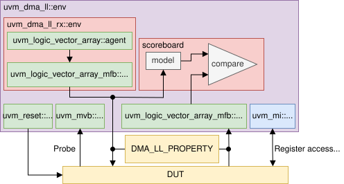

.. _rx_dma_calypte:

RX DMA Calypte
==============

The RX DMA Calypte controller is a standalone component of the DMA Calypte module, designed for
transferring packet data in the F2H (FPGA-to-Host) direction. The block diagram below illustrates
its internal architecture:

    Schematic view of the internal blocks within the RX DMA Calypte controller

The controller accepts packets on the ``USER_RX_MFB`` bus and generates PCIe transactions on its
output, the ``PCIE_UP_MFB`` bus. Each packet is segmented into 128-byte transactions that are
dispatched as individual PCIe transactions.  This 128-byte segment size has been selected as a
compromise between high throughput and low latency. While future modifications to the segment size
are possible, they will not affect the entity's port configuration.

.. vhdl:autoentity:: RX_DMA_CALYPTE

Control/Status Registers
------------------------

To enable software control, the controller utilizes an address space with configuration/status (C/S)
registers. Currently, each channel has its own register space, each having a size of 128 bytes. The
first channel's registers are located at address **0x00**, the second at **0x80**, the third at
**0x100**, and so on. These registers are connected to the :ref:`MI bus <mi_bus>`.  The C/S register
set for one channel is shown in the following table:

.. list-table:: Tab. 1
    :align: center
    :widths: auto
    :header-rows: 1

    * - Address
      - Name
      - Access permission (FPGA/Host)
      - Description
    * - 0x00
      - Control
      - R/W
      - Bit 0: Set to 1 to request the enable of a channel; set to 0 to request a stop.
    * - 0x04
      - Status
      - W/R
      - Bit 0: Set to 1 if a channel is enabled; 0 if disabled.
    * - 0x08
      - -Reserved-
      - N/A
      - \-
    * - 0x0C
      - -Reserved-
      - N/A
      - \-
    * - 0x10
      - Software data pointer (SDP)
      - R/W
      - Read pointer for data (up to 16 bits).
    * - 0x14
      - Software header pointer (SHP)
      - R/W
      - Read pointer for headers (up to 16 bits)
    * - 0x18
      - Hardware data pointer (HDP)
      - W/R
      - Write pointer for data (up to 16 bits)
    * - 0x1C
      - Hardware header pointer (HHP)
      - W/R
      - Write pointer for headers (up to 16 bits)
    * - 0x20
      - -Reserved-
      - N/A
      - \-
    * - 0x24
      - -Reserved-
      - N/A
      - \-
    * - 0x28
      - -Reserved-
      - N/A
      - \-
    * - 0x2C
      - -Reserved-
      - N/A
      - \-
    * - 0x30
      - -Reserved-
      - N/A
      - \-
    * - 0x34
      - -Reserved-
      - N/A
      - \-
    * - 0x38
      - -Reserved-
      - N/A
      - \-
    * - 0x3C
      - -Reserved-
      - N/A
      - \-
    * - 0x40
      - Data baseL
      - R/W
      - Base addres of the data buffer in a host memory (lower 32 bits).
    * - 0x44
      - Data baseH
      - R/W
      - Base addres of the data buffer in a host memory (upper 32 bits).
    * - 0x48
      - Header baseL
      - R/W
      - Base addres of the header buffer in a host memory (lower 32 bits).
    * - 0x4C
      - Header baseH
      - R/W
      - Base addres of the header buffer in a host memory (upper 32 bits).
    * - 0x50
      - -Reserved-
      - N/A
      - \-
    * - 0x54
      - -Reserved-
      - N/A
      - \-
    * - 0x58
      - Data pointer mask (DPM)
      - R/W
      - Determines the data buffer size
    * - 0x5C
      - Header pointer mask (HPM)
      - R/W
      - Determines the header buffer size
    * - 0x60
      - Received packetsL
      - W/RW (Strobe)
      - Counter of received packets (lower part)
    * - 0x64
      - Received packetsH
      - W/RW (Strobe)
      - Counter of received packets (upper part)
    * - 0x68
      - Received bytesL
      - W/RW (Strobe)
      - Counter of received bytes (lower part)
    * - 0x6C
      - Received bytesH
      - W/RW (Strobe)
      - Counter of received bytes (upper part)
    * - 0x70
      - Discarded packetsL
      - W/RW (Strobe)
      - Counter of discarded packets (lower part)
    * - 0x74
      - Discarded packetsH
      - W/RW (Strobe)
      - Counter of discarded packets (upper part)
    * - 0x78
      - Discarded bytesL
      - W/RW (Strobe)
      - Counter of discarded bytes (lower part)
    * - 0x7C
      - Discarded bytesH
      - W/RW (Strobe)
      - Counter of discarded bytes (upper part)

.. NOTE:: Counter registers have a strobe functionality that requires specific
    writes to manipulate a counter's register from the host:

    :0b0: Resets all counters and its register
    :0b1: Samples all counters to their respective registers
    :0b10: Combination of the two previous, i.e. sample the values of all counters to their
           registers and put counters to reset.

    Write to one counter register affects all counters as well as their registers. This ensures
    value coherency between the counters.

Start sequence
^^^^^^^^^^^^^^

The *Control* and *Status* registers are the most important ones in terms of
ensuring the channel's activity. When a start of a channel is requested, several
registers need to be initialized from the MI bus:

#. The *DataBaseL*, *DataBaseH*, *HeaderBaseL* and *HeaderBaseH* registers need
   to contain valid addresses that were previously reserved in the host memory.
   This memory needs to be initialized as DMA-able.
#. The SDP and SHP pointer registers need to be initialized to 0.
#. Finally, a write of value ``0b1`` to the Control register is issued. This
   immediately starts the required channel that responds by setting the Status
   register to ``1b1``. The controller is now ready to transmit application
   data.

Stop sequence
^^^^^^^^^^^^^

If a stop of a channel is requested, the ``0b0`` value is written to its Control
register. The controller completes the dispatch of a currently processed packet
(if there is any for this channel) and waits for the software to process all of
the packets on this channel. This is indicated by an update of SDP and SHP
registers to newer values which are now equal to the HDP and HHP registers. This
signifies the successful stop sequence and the controller indicates this by
setting the Status register of the stopped channel to ``0b0``. The stopped
channel does not forward any incoming data and drops them (however, every other
enabled channel can still send its data to the host memory).

.. NOTE:: Although many channels can be deactivated at once from the software,
   the controller deactivates them sequentially. This also applies to the
   execution of the start sequence.

Data transmission
-----------------

The data transmission occurs over one or multiple channels using the shared MFB
bus. Every incoming packet is accompanied by an index of a channel processing
this packet, the length of application metadata which allows to distinguish a
user header that precedes the packet data, and application-specific flags [#f2]_.
These fields get separated from the packet data when entering the F2H
controller.

In the ``INPUT_BUFFER``, every packet is aligned to the beginning of a bus word. This
simplifies the buffering in the ``TRANS_BUFFER`` that gathers bus words in order
to form the 128 B segments [#f1]_. This results in 4 words or 2 words in total
for 256-bit or 512-bit bus, respectively (see
:ref:`dma_calyp_supp_pcie_configs`). The buffered segment is prepended with a
PCIe header in the ``HDR_INSERTOR`` component and dispatched to the PCIe domain
with the address of the channel's **Data buffer**. The component dispatches
every other segment in the same way while updating the HDP register value. After
the packet has ended and the last segment has been sent, the ``HDR_INSERTOR`` sends the
last PCIe transaction containing the **DMA Header** that indicates the delivery
of a packet in the host memory. The DMA Headers are stored in a separate *Header
Buffer* within each channel. When the controller sends the DMA Header
transaction, the value of the HHP register is updated. The software driver
periodically polls the position of a current head pointer (the value of SHP) in
the header buffer until it captures valid data. The format of the DMA header can
be seen in the following figure:

.. figure:: img/dma_headers-RX_alt.svg
    :align: center
    :scale: 150

    A DMA header is used by the SW to identify a received packet. The header is 64
    B long and comprises four fields. The Valid bit (marked V) is set to 1 when
    dispatched from the controller and then periodically polled by the SW that
    then recognizes a new header in the header buffer. The User header length
    and Packet flags fields get copied from the metadata of a packet upon
    entering the controller.

The ``HDR_MANAGER`` component accepts the incoming packet metadata and generates PCIe
headers as well as the DMA header for each packet with the information on whether a
packet is to be dropped or not. A necessary *Flow control* mechanism is
established by the pairs of read/write pointers (SDP with HDP and SHP with HHP)
and if the software is not able to read data fast enough (e.g. the HDP
catches up with the SDP), the ``HDR_MANAGER`` pauses the generation of PCIe
headers for the current packet, thus stopping the transmission from
``HDR_INSERTOR`` as well. This is the only case of transaction blocking in the
F2H controller.

Upon header/data access, the SW updates the SDP and SHP values in the channel's C/S
register space. These registers are located in the ``SW_MANAGER``
component along with packet counters for each channel. This component also handles the
proper execution of the start and the stop sequence. The ``HDR_INSERTOR``
increments the appropriate packet counter upon dispatching the DMA header of a packet when
the channel is active or when receiving the end of a packet when the channel is
inactive.

UVM Verification
----------------

The verification is supplied using the UVM framework with random input/output sequences and a UVM
register layer.

    The structural diagram of the UVM verification environment. Green blocks are the classes of the
    UVM library. The Probe input is used to sample the value of the packet discard signal that
    indicates if a packet needs to dropped or not.

Local Subcomponents
-------------------
.. toctree::
   :maxdepth: 1

   comp/input_buffer/readme
   comp/trans_buffer/readme
   comp/hdr_insertor/readme
   comp/hdr_manager/readme
   comp/software_manager/readme

.. rubric:: Footnotes

.. [#f2] The metadata follow the general format of the ``MVB_HDR_META`` signal
         as specified in the :ref:`Header metadata format <hdr_meta_format>`.

.. [#f1] The reason for buffering the segments is that the PCIe IP does not
         support any gaps in the data between a transaction's start and end.
         Because of that, the data needs to be sent
         continuously before ending the transaction. For more information refer
         to the *Requester Request Interface* description in the *UltraScale+
         Devices Integrated Block for PCI Express Product Guide
         (PG213)*.
