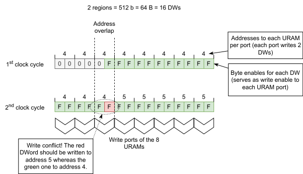

.. _tx_dma_calypte_trans_buffer:

Transaction buffer
==================

.. vhdl:autoentity:: TX_DMA_PCIE_TRANS_BUFFER

Implementation notes
--------------------

There has been an attempt by a fellow creator of this component to replace the internal RAM array
with URAM for AMD devices. Using URAMs provides a significant resource saving with RAM block
consumption reduced by the factor of 8. This means using 8 URAMs or 4 URAMs for 2-region and
1-region variant of the component respectively instead of the 64 or 32 BRAMs . This is because both
the URAM blocks are actually dual-port (Not as *true* dual-port since the ports do not support
independent clocking or different data width, but suitable for a use in this entity) and can be used
for the 2-region variant as well, and the port has a fixed width of 8 bytes. Secondly, although
URAMs have fixed data width for each port, they still provide byte enable feature for writing that
allows byte level writes which conforms to the present FirstBE and LastBE signals used by the PCIe.

Inspite the biggest saving in resources, one major flaw remains of this approach renders this
implementation unusable. The elementary unit addressable by the PCIe is one DWord and there can be a
situation where two DWords next to each other (This counts first DWord of a bus beat and the last
one as the neighboring. This is because the barrel shifter is used internally which, by rotation,
causes these two DWs appear next to each other.) need to be addressed to different locations. This
is shown in figure ":ref:`uram_impl_note`". The internal buffer is organized as an array of RAM
blocks that form a buffer able to write data on line rate from both regions of the MFB bus beat. The
problem with two neighboring DWords addressed to two different locations appears in the URAM-based
buffer when these two appear on one port (one URAM port has a fixed width of 8 bytes without
parity). One URAM port cannot handle this situation and with current address handling, the
conflicting DWord (meaning the one that should be located on a higher address) overwrites previously
stored data. This problem does not appear with the BRAM-based array that uses BRAMs with 1-byte ports
and therefore allows for fine grained addressing of each individual byte.

   Depiction of a write conflict when using URAM-based buffer

General subcomponents
---------------------
* :ref:`barrel_shifter`
* :ref:`sdp_bram`
