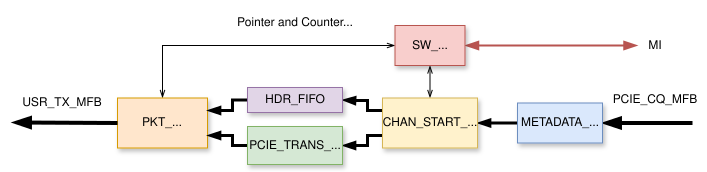
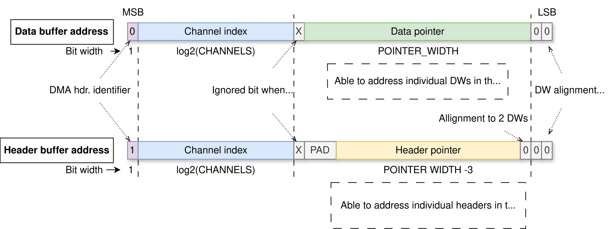
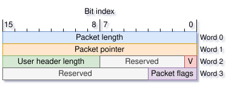
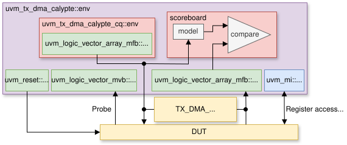

.. _tx_dma_calypte:

TX DMA Calypte
==============

The TX DMA Calypte controller is a standalone component of the DMA Calypte module designed for data
transfers in the H2F (Host-to-FPGA) direction. The following figure shows the internal layout of
the controller:

    Schematic view of the internal blocks within the TX DMA Calypte controller

The component accepts PCIe transactions on the ``PCIE_CQ_MFB`` input and dispatches packets towards
the application logic from the ``USR_TX_MFB`` output. Each packet consists of multiple PCIe
transactions of various lengths that are merged in the internal data buffer. Every packet
is followed by its *DMA header* that identifies it in the data buffer. The packets are transferred
over multiple virtual channels, each comprising a separate buffer space for its packets.

.. vhdl:autoentity:: TX_DMA_CALYPTE

Control/Status Registers
------------------------

To enable software control, the controller utilizes an address space with
configuration/status (C/S) registers. Currently, each channel has its own
register space, each having a size of 128 bytes. The first channel's registers
are located at address **0x00**, the second at **0x80**, the third at **0x100**,
and so on. These registers are connected to the :ref:`MI bus <mi_bus>`.
The C/S register set for one channel is shown in the
following table:

.. list-table:: Tab. 1
    :align: center
    :widths: auto
    :header-rows: 1

    * - Address
      - Name
      - Access permission (FPGA/Host)
      - Description
    * - 0x00
      - Control
      - R/W
      - Bit 0: Set to 1 to request the enable of a channel; set to 0 to request a stop.
    * - 0x04
      - Status
      - W/R
      - Bit 0: Set to 1 if a channel is enabled; 0 if disabled.
    * - 0x08
      - -Reserved-
      - N/A
      - \-
    * - 0x0C
      - -Reserved-
      - N/A
      - \-
    * - 0x10
      - Software data pointer (SDP)
      - R/W
      - Write pointer for data (up to 16 bits)
    * - 0x14
      - Software header pointer (SHP)
      - R/W
      - Write pointer for headers (up to 16 bits)
    * - 0x18
      - Hardware data pointer (HDP)
      - R/W
      - Read pointer for data (up to 16 bits)
    * - 0x1C
      - Hardware header pointer (HHP)
      - R/W
      - Read pointer for headers (up to 16 bits)
    * - 0x20
      - -Reserved-
      - N/A
      - \-
    * - 0x24
      - -Reserved-
      - N/A
      - \-
    * - 0x28
      - -Reserved-
      - N/A
      - \-
    * - 0x2C
      - -Reserved-
      - N/A
      - \-
    * - 0x30
      - -Reserved-
      - N/A
      - \-
    * - 0x34
      - -Reserved-
      - N/A
      - \-
    * - 0x38
      - -Reserved-
      - N/A
      - \-
    * - 0x3C
      - -Reserved-
      - N/A
      - \-
    * - 0x40
      - -Reserved-
      - N/A
      - \-
    * - 0x44
      - -Reserved-
      - N/A
      - \-
    * - 0x48
      - -Reserved-
      - N/A
      - \-
    * - 0x4C
      - -Reserved-
      - N/A
      - \-
    * - 0x50
      - -Reserved-
      - N/A
      - \-
    * - 0x54
      - -Reserved-
      - N/A
      - \-
    * - 0x58
      - Data pointer mask (DPM)
      - W/R
      - Determines data buffer size
    * - 0x5C
      - Header pointer mask (HPM)
      - W/R
      - Determines header buffer size
    * - 0x60
      - Received packetsL
      - W/RW (Strobe)
      - Counter of received packets (lower part)
    * - 0x64
      - Received packetsH
      - W/RW (Strobe)
      - Counter of received packets (upper part)
    * - 0x68
      - Received bytesL
      - W/RW (Strobe)
      - Counter of received bytes (lower part)
    * - 0x6C
      - Received bytesH
      - W/RW (Strobe)
      - Counter of received bytes (upper part)
    * - 0x70
      - Discarded packetsL
      - W/RW (Strobe)
      - Counter of discarded packets (lower part)
    * - 0x74
      - Discarded packetsH
      - W/RW (Strobe)
      - Counter of discarded packets (upper part)
    * - 0x78
      - Discarded bytesL
      - W/RW (Strobe)
      - Counter of discarded bytes (lower part)
    * - 0x7C
      - Discarded bytesH
      - W/RW (Strobe)
      - Counter of discarded bytes (upper part)

.. NOTE::
   Some registers have a *strobe* functionality in which case specific
   writes on a counter's address need to be issued from the host in order to
   manipulate a counter's register:

    :0x0: Resets a counter and its register
    :0x1: Samples a value of a counter to its register
    :0x2: Combination of the two previous, e.g. a value of a counter is sampled
          to its register and the counter is put to reset.

Start sequence
^^^^^^^^^^^^^^

The *Control* and *Status* registers are the most important ones in terms of ensuring the channel's
activity. When a start of a channel is requested, some registers need to be initialized from the MI
bus:

#. The SDP and SHP pointer registers need to be initialized to 0.
#. A write of value ``0b1`` to the Control register is issued. This immediately starts the required
   channel that responds by setting the Status register to ``1b1``. The controller is now ready to
   transmit data from the software.

Stop sequence
^^^^^^^^^^^^^

If a stop of a channel is requested, the ``0b0`` value is written to its Control register. The
controller completes the dispatch of a currently processed packet (if there is any for this channel)
and all previously received. This is indicated by an update of HDP and HHP registers to newer
values which, in the end, have equal value as the SDP and SHP registers. This signifies the
successful stop sequence and the controller indicates this by setting the Status register of the
stopped channel to ``0b0``. The stopped channel does not forward any incoming data and drops them
(however, every other enabled channel can still receive the data from the software).

.. NOTE:: Although many channels can be deactivated at once from the software,
   the controller deactivates them sequentially. This also applies to the
   execution of the start sequence.

Data transmission
-----------------

The data transmission occurs over one or multiple channels using the shared MFB bus. Every incoming
packet is received as a set of PCIe transactions. The PCIe address within each transaction's header
contains information about the channel on which this transaction gets transferred, the pointer to the
data/header buffer, and the information on whether the transaction contains packet data or a DMA header. The
address format is shown in the following figure:

    A structure of the PCIe address as processed by the ``METADATA_EXTRACTOR`` component. The X bit
    gets ignored but this address extension minimizes alignment overhead in the software when
    writing a packet that crosses the buffer boundary.

The PCIe header is cut off from a PCIe transaction when passed through ``METADATA_EXTRACTOR`` and
metadata are further transported with the beginning of a transaction. The second component
``START_STOP_CTLR`` handles transaction forwarding based on the channel's activity. This component drops
transactions when the channel is inactive and forwards them when active. It is also a direct
respondent to the ``SW_MANAGER`` when the Start/Stop sequence takes place. Accepted transactions are
forwarded either to ``PCIE_TRANS_BUFFER`` or ``HDR_FIFO`` (instantiated as
``dma_hdr_fifo_i`` in the top-level entity) based on their content.

The different types of buffers have been chosen based on the ordering of PCIe transactions.  To
ensure sufficient throughput, the software driver incorporates write-combining [#f2]_ of packet
data.  However, this introduces weak ordering of transactions that are written to specific
addresses in the BRAM array of the ``PCIE_TRANS_BUFFER``. After each packet gets written from the
host software, memory fencing is triggered and the DMA header is written after that. The DMA header
is shown in the following figure and follows the same format as in the case of
:ref:`rx_dma_calypte`. After fencing is issued, it is ensured that DMA header always comes in order
with packet data. Enforcing such ordering ensures that DMA header arrives after all of packet data
have been received. The header is simply stored in a FIFO storage that is common to all channels.

    A DMA header format is the same as used in the RX DMA controller with the only exception that
    the V bit is ignored. The User header length and Packet flags fields get copied and transported
    with the beginning of a packet.

.. NOTE:: Since every channel is controlled by a separate process in the software, the data can be
          written in parallel. These, however, arrive on a common MFB bus and are thus read
          sequentially based on the order in which DMA headers arrived.

The ``PKT_DISPATCHER`` reads composed packets from the transaction buffer based on the received DMA
headers in the header FIFO. The application metadata, such as *User header length* and *Packet
flags*, are copied from the DMA header of each packet [#f1]_. When the end of a packet is reached,
the component updates the read pointers (located in *HDP* and *HHP* registers) and also the counter
of sent packets/bytes. The register array and packet counters for every channel are instantiated in
the ``SW_MANAGER`` component, which also triggers the start/stop sequence on a channel.

UVM Verification
----------------

The verification is supplied using the UVM framework with random input/output sequences and a UVM
register layer.

    The structural diagram of the UVM verification environment. Green blocks are the classes of the
    UVM library. The Probe input is used to sample the value of the packet discard signal that
    indicates if a packet needs to dropped or not.

Verification Plan
^^^^^^^^^^^^^^^^^

All of these tests were checked in a verification with a random seed. The verification
files are located in the ``uvm/`` directory

.. list-table:: Tab. 2
    :align: center
    :widths: 5 15 5 5 10 5
    :header-rows: 1

    * - ID
      - Description
      - Requirement level
      - Checked by
      - Status
      - Test name
    * - base
      - Simple packet transfer and check if no packets are dropped/damaged on an enabled channel. Randomly
        enable/disable the channels (check the packet counters on the end).
      - Required
      - Counter check on the end of test
      - Verified
      - test::base
    * - mult_region
      - For a multiple-regions configuration vary the packet begins/ends in all regions. This puts the
        transaction buffer under stress test.
      - Required
      - Func. cover
      - Verified
      - test::base/test::speed
    * - pkt_drop
      - Check if packets are dropped on a disabled channel. Check if the counters of dropped packets have
        correct values.
      - Required
      - Counter check on the end of a test
      - Verified
      - test::base
    * - thrp_meas
      - Measure throughput in Gbps.
      - Optional
      - Reported periodically by the *statistics* class from the ``uvm_mfb`` environment. (The verbosity needs
        to be set to ``UVM_LOW`` in order to display these statistics)
      - Verified
      - test::speed
    * - lat_meas
      - Measure latency from input to output. Report average value, maximum,
        minimum and standard deviation. Repeat 10000 times and report values in
        the documentation.
      - Optional
      - None
      - Unverified
      - Special sequence that does measurement for a single packet.

Local Subcomponents
-------------------
.. toctree::
   :maxdepth: 1

   comp/metadata_extractor/readme
   comp/chan_start_stop_ctrl/readme
   comp/packet_dispatcher/readme
   comp/pcie_trans_buffer/readme
   comp/software_manager/readme

General Subcomponents
---------------------
* :ref:`fifox_multi`

.. rubric:: Footnotes

.. [#f1] The metadata follow the general format of the ``MVB_HDR_META`` signal as specified in the
         :ref:`Header metadata format <hdr_meta_format>`.

.. [#f2] Write-combining (WC) is a mapping of a memory region (in case of the H2F controller, the
         mapping PCI BAR in the driver) that improves processor write performance by combining
         multiple write transactions to a bigger burst. However, WC employs a weakly ordered model a
         delayed dispatch of transactions. Therefore, the fencing operation needs to take place to
         ensure data coherency. A call to fence ensures the completion of all previously triggered load
         and store instructions.
