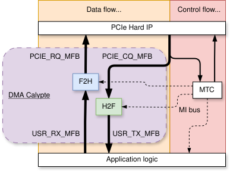

.. _dma_calypte:

DMA Calypte
===========

This module allows simple DMA access to the host memory over the PCI Express interface for both,
*Host-to-FPGA (H2F)* and *FPGA-to-Host (F2H)* directions.  The design was primarily focused on the
lowest latency possible.  The module contains two controllers for each direction: the F2H (formerly
named RX) and the H2F (formerly named TX) controller. These allow for the full-duplex transmission
of packet data from/to the host memory. The controllers connect to the surrounding infrastructure
using the :ref:`MFB bus<mfb_bus>`. The packet transmission is part of the Data Flow which is
distinguished from the Control Flow. The Control Flow is established using the :ref:`MI bus<mi_bus>`
that accesses internal Control and Status (C/S) registers. Each of the controllers contains multiple
virtual channels that share the same MFB bus but have separate address spaces in the host memory.
This allows for concurrent access from the host system. The block scheme of the DMA module is
provided in the following figure:

    The block sheme of the DMA Calypte module and its integration into the NDK
    framework.

.. vhdl:autoentity:: DMA_CALYPTE

.. _dma_calyp_supp_pcie_configs:

Supported PCIe Configurations
-----------------------------

The design can be configured for two major PCIe IP configurations.
This corresponds to setting the input/output MFB bus
interfaces when configuring the DMA_CALYPTE entity.

#. Device: AMD UltraScale+ Architecture, Intel Avalon P-Tile

   PCI Express configuration: **Gen3 x8**

   Internal bus width: 256 bits

   Frequency: 250 MHz

   Input MFB configuration: 1,4,8,8

   Output MFB configuration: 1,1,8,32

#. Device: AMD UltraScale+ architecture, Intel Avalon P-Tile/R-Tile

   PCI Express configuration: **Gen3 x16 (AMD), Gen4 x16 (Intel)**, **Gen5 x8 (Intel)**

   Internal bus width: 512 bits

   Frequency: 250 MHz (AMD), 400 MHz (Intel)

   Input MFB configuration: 1,8,8,8

   Output MFB configuration: 2,1,8,32

Resource consumption
--------------------

The following tables show the resource utilization on the AMD Virtex UltraScale+
chip (``xcvu7p-flvb2104-2-i``) for *Gen3 x8* and *Gen3 x16* PCIe configurations.

+---------------+------------------+---------------+---------------+---------------+
|               | PCIe Gen3 x8                     | PCIe Gen3 x16                 |
+               +------------------+---------------+---------------+---------------+
|               | 16 channels      |64 channels    |16 channels    |64 channels    |
+===============+==================+===============+===============+===============+
| LUT as Logic  | 7650 (0.97%)     | 10441 (1.32%) | 16257 (2.06%) | 18571 (2.36%) |
+---------------+------------------+---------------+---------------+---------------+
| LUT as Memory | 1466 (0.37%)     | 2310 (0.59%)  | 1592 (0.40%)  | 2446 (0.62%)  |
+---------------+------------------+---------------+---------------+---------------+
| Registers     | 10156 (0.64%)    | 11614 (0.74%) | 16290 (1.03%) | 17929 (1.14%) |
+---------------+------------------+---------------+---------------+---------------+
| CARRY logic   | 141 (0.14%)      | 238 (0.24%)   | 145 (0.15%)   | 243 (0.25%)   |
+---------------+------------------+---------------+---------------+---------------+
| RAMB36 Tiles  | 32 (2.22%)       | 128 (8.89%)   | 0 (0.00%)     | 128 (8.89%)   |
+---------------+------------------+---------------+---------------+---------------+
| RAMB18 Tiles  | 8 (0.28%)        | 8 (0.28%)     | 72 (2.50%)    | 8 (0.28%)     |
+---------------+------------------+---------------+---------------+---------------+
| URAMs         | 8 (1.25%)        | 32 (5.00%)    | 8 (1.25%)     | 32 (5.00%)    |
+---------------+------------------+---------------+---------------+---------------+
| DSPs          | 4 (0.09%)        | 4 (0.09%)     | 4 (0.09%)     | 4 (0.09%)     |
+---------------+------------------+---------------+---------------+---------------+

Latency report
--------------

.. NOTE::
   Unless given explicitly, all measured values are in microseconds.

Since this module has been designed for low latency, this is our primary concern. Even though its
RTL design reaches the minimum latency, the PCI Express protocol remains the biggest contributor to
the overall latency. From our observations, the latency is also influenced by the vendor
of the CPU where Intel devices perform slightly better than AMD devices. Some PCIe IPs for FPGAs
provide a special low-latency mode such as the PCIE4 block used in *AMD UltraScale+* architecture, which
is enabled on all AMD cards whose measurements we provide. The latency is always measured as a
*Round-Trip-Time (RTT)* latency either on the path: *Host -> H2F Controller -> FPGA -> F2H Controller
-> Host (HFH)*, or *FPGA -> F2H Controller -> Host -> H2F Controller -> FPGA (FHF)*, which will be
denoted for specific results. Every time the data are looped back, either in the Host for the FHF path
or in the FPGA for the HFH path, the loopback is established with the shortest path possible (E.g., for the
HFH to directly connect *USR_TX_MFB* to the *USR_RX_MFB* interface).

AMD FPGA Gen3x8
^^^^^^^^^^^^^^^

* Card: Silicom fb2CGhh (Chip: ``xcku15p-ffve1760-2-e``)

  CPU: Intel Xeon CPU E5-2630 v4 @ 2.20GHz

  RAM: 32 GB

  PCIe configuration: Gen3x8 (low latency configuration)

* FHF latency (16384 repetitions)

  The following table summarizes the measured results. The form of a distribution function has been
  chosen as the most suitable since the measured latency values have a normal distribution across
  the set. The quantiles are labeled with a letter "P" followed by its value, meaning P1 the
  0.01-quantile, P50 the 0.5-quantile (or median), etc.

    +-------------+-------+--------+---------+---------+---------+--------+
    | Packet size |  Min  | P1-lat | P50-lat | P80-lat | P99-lat |  Max   |
    +=============+=======+========+=========+=========+=========+========+
    | 60B         | 0.796 | 0.825  | 0.842   | 0.855   | 0.892   | 24.676 |
    +-------------+-------+--------+---------+---------+---------+--------+
    | 64B         | 0.796 | 0.820  | 0.837   | 0.847   | 0.887   | 17.284 |
    +-------------+-------+--------+---------+---------+---------+--------+
    | 128B        | 0.804 | 0.831  | 0.843   | 0.855   | 0.892   | 18.768 |
    +-------------+-------+--------+---------+---------+---------+--------+
    | 256B        | 0.832 | 0.857  | 0.874   | 0.886   | 0.924   | 19.168 |
    +-------------+-------+--------+---------+---------+---------+--------+
    | 512B        | 0.900 | 0.928  | 0.939   | 0.952   | 0.990   | 18.440 |
    +-------------+-------+--------+---------+---------+---------+--------+
    | 1024B       | 1.052 | 1.078  | 1.095   | 1.105   | 1.143   | 19.640 |
    +-------------+-------+--------+---------+---------+---------+--------+
    | 1500B       | 1.228 | 1.254  | 1.271   | 1.281   | 1.324   | 18.236 |
    +-------------+-------+--------+---------+---------+---------+--------+

    .. figure:: img/latency_fb2cghh_oliver.svg
            :align: center
            :scale: 10

* HFH latency (64 B packets, 1000000 repetitions)

  822 ns (median), 1241 ns (0.99-quantile)

* HFH latency (1500 B packets, 1000000 repetitions)

  1340 ns (median), 1401 ns (0.99-quantile)

Intel FPGA Gen3x8
^^^^^^^^^^^^^^^^^

.. NOTE::
   This 8-lane PCIe configuration is not officially provided by the NDK
   framework. It has been published here to only provide a comparison with the
   equally configured AMD-based FPGA card.

* Card: Silicom FPGA SmartNIC N6010 (Chip: ``AGFB014R24A2E2V``)

  CPU: Intel Xeon CPU E5-2630 v4 @ 2.20GHz

  RAM: 32 GB

  PCIe configuration: Gen3x8

* FHF latency (16384 repetitions)

     +-------------+-------+--------+---------+---------+---------+--------+
     | Pakcet size | Min   | P1-lat | P50-lat | P80-lat | P99-lat |  Max   |
     +=============+=======+========+=========+=========+=========+========+
     | 60B         | 0.876 | 0.897  | 0.910   | 0.923   | 0.965   | 17.836 |
     +-------------+-------+--------+---------+---------+---------+--------+
     | 64B         | 0.872 | 0.890  | 0.907   | 0.921   | 0.959   | 20.972 |
     +-------------+-------+--------+---------+---------+---------+--------+
     | 128B        | 0.888 | 0.906  | 0.922   | 0.935   | 0.973   | 17.908 |
     +-------------+-------+--------+---------+---------+---------+--------+
     | 256B        | 0.920 | 0.938  | 0.954   | 0.966   | 1.006   | 18.028 |
     +-------------+-------+--------+---------+---------+---------+--------+
     | 512B        | 0.980 | 1.001  | 1.016   | 1.026   | 1.070   | 19.660 |
     +-------------+-------+--------+---------+---------+---------+--------+
     | 1024B       | 1.128 | 1.155  | 1.169   | 1.182   | 1.219   | 18.452 |
     +-------------+-------+--------+---------+---------+---------+--------+
     | 1500B       | 1.300 | 1.329  | 1.342   | 1.357   | 1.401   | 18.236 |
     +-------------+-------+--------+---------+---------+---------+--------+

    .. figure:: img/latency_n6010_oliver.svg
            :align: center
            :scale: 10

AMD FPGA Gen3x16
^^^^^^^^^^^^^^^^

* Card: Silicom fb2CGhh (Chip: ``xcku15p-ffve1760-2-e``)

  CPU: Intel Xeon CPU E5-2630 v4 @ 2.20GHz

  RAM: 32 GB

  PCIe configuration: Gen3x16

* FHF latency (16384 repetitions)

    +-------------+-------+--------+---------+---------+---------+--------+
    | Packet size |  Min  | P1-lat | P50-lat | P80-lat | P99-lat |  Max   |
    +=============+=======+========+=========+=========+=========+========+
    |   60B       | 0.800 | 0.819  | 0.839   | 0.856   | 0.894   | 17.828 |
    +-------------+-------+--------+---------+---------+---------+--------+
    |   64B       | 0.792 | 0.814  | 0.830   | 0.846   | 0.886   | 17.752 |
    +-------------+-------+--------+---------+---------+---------+--------+
    |   128B      | 0.804 | 0.819  | 0.834   | 0.845   | 0.885   | 18.444 |
    +-------------+-------+--------+---------+---------+---------+--------+
    |   256B      | 0.828 | 0.839  | 0.857   | 0.872   | 0.910   | 18.856 |
    +-------------+-------+--------+---------+---------+---------+--------+
    |   512B      | 0.880 | 0.898  | 0.910   | 0.923   | 0.959   | 17.832 |
    +-------------+-------+--------+---------+---------+---------+--------+
    |   1024B     | 0.984 | 1.000  | 1.016   | 1.027   | 1.070   | 18.020 |
    +-------------+-------+--------+---------+---------+---------+--------+
    |   1500B     | 1.076 | 1.094  | 1.114   | 1.133   | 1.184   | 20.216 |
    +-------------+-------+--------+---------+---------+---------+--------+

    .. figure:: img/latency_x16_fb2cghh_oliver.svg
            :align: center
            :scale: 10

Intel FPGA Gen4x16
^^^^^^^^^^^^^^^^^^

* Card: Silicom FPGA SmartNIC N6010 (Chip: ``AGFB014R24A2E2V``)

* CPU: Intel Xeon Gold 6342 CPU @ 2.80GHz

* RAM: 128 GB

* PCIe configuration: Gen4x16

* FHF latency (16384 repetitions)

    +-------------+-------+--------+---------+---------+---------+--------+
    | Packet size |  Min  | P1-lat | P50-lat | P80-lat | P99-lat |  Max   |
    +=============+=======+========+=========+=========+=========+========+
    | 60B         | 0.965 | 1.049  | 1.069   | 1.084   | 1.116   | 4.240  |
    +-------------+-------+--------+---------+---------+---------+--------+
    | 64B         | 0.968 | 1.044  | 1.066   | 1.082   | 1.118   | 3.822  |
    +-------------+-------+--------+---------+---------+---------+--------+
    | 128B        | 0.968 | 1.052  | 1.073   | 1.087   | 1.112   | 3.645  |
    +-------------+-------+--------+---------+---------+---------+--------+
    | 256B        | 1.030 | 1.068  | 1.087   | 1.101   | 1.128   | 3.420  |
    +-------------+-------+--------+---------+---------+---------+--------+
    | 512B        | 1.052 | 1.094  | 1.112   | 1.124   | 1.148   | 3.717  |
    +-------------+-------+--------+---------+---------+---------+--------+
    | 1024B       | 1.115 | 1.145  | 1.162   | 1.176   | 1.224   | 3.675  |
    +-------------+-------+--------+---------+---------+---------+--------+
    | 1500B       | 1.177 | 1.223  | 1.264   | 1.356   | 1.408   | 4.765  |
    +-------------+-------+--------+---------+---------+---------+--------+

    .. figure:: img/latency_x16_n6010_mourvedre.svg
            :align: center
            :scale: 10

* HFH latency (64 B packets, 1000000 repetitions)

  866 ns (median), 1340 ns (0.99-quantile)

* HFH latency (1500 B packets, 1000000 repetitions)

  1292 ns (median), 2241 ns (0.99-quantile)

Comparison of FPGA vendors
^^^^^^^^^^^^^^^^^^^^^^^^^^

* Cards: Silicom FPGA SmartNIC N6010 and Silicom fb2CGhh

  CPU: Intel Xeon CPU E5-2630 v4 @ 2.20GHz

  RAM: 32 GB

  PCIe configuration: Gen3x8

* FHF latency (16384 repetitions)

  The graph beneath the table picks only some of the packet lengths showed in the table.

    +-------------+-------+--------+---------+---------+---------+--------+
    | Packet size |  Min  | P1-lat | P50-lat | P80-lat | P99-lat |  Max   |
    +=============+=======+========+=========+=========+=========+========+
    | amd_60B     | 0.796 | 0.825  | 0.842   | 0.855   | 0.892   | 24.676 |
    +-------------+-------+--------+---------+---------+---------+--------+
    | intel_60B   | 0.876 | 0.897  | 0.910   | 0.923   | 0.965   | 17.836 |
    +-------------+-------+--------+---------+---------+---------+--------+
    | amd_64B     | 0.796 | 0.820  | 0.837   | 0.847   | 0.887   | 17.284 |
    +-------------+-------+--------+---------+---------+---------+--------+
    | intel_64B   | 0.872 | 0.890  | 0.907   | 0.921   | 0.959   | 20.972 |
    +-------------+-------+--------+---------+---------+---------+--------+
    | amd_128B    | 0.804 | 0.831  | 0.843   | 0.855   | 0.892   | 18.768 |
    +-------------+-------+--------+---------+---------+---------+--------+
    | intel_128B  | 0.888 | 0.906  | 0.922   | 0.935   | 0.973   | 17.908 |
    +-------------+-------+--------+---------+---------+---------+--------+
    | amd_256B    | 0.832 | 0.857  | 0.874   | 0.886   | 0.924   | 19.168 |
    +-------------+-------+--------+---------+---------+---------+--------+
    | intel_256B  | 0.920 | 0.938  | 0.954   | 0.966   | 1.006   | 18.028 |
    +-------------+-------+--------+---------+---------+---------+--------+
    | amd_512B    | 0.900 | 0.928  | 0.939   | 0.952   | 0.990   | 18.440 |
    +-------------+-------+--------+---------+---------+---------+--------+
    | intel_512B  | 0.980 | 1.001  | 1.016   | 1.026   | 1.070   | 19.660 |
    +-------------+-------+--------+---------+---------+---------+--------+
    | amd_1024B   | 1.052 | 1.078  | 1.095   | 1.105   | 1.143   | 19.640 |
    +-------------+-------+--------+---------+---------+---------+--------+
    | intel_1024B | 1.128 | 1.155  | 1.169   | 1.182   | 1.219   | 18.452 |
    +-------------+-------+--------+---------+---------+---------+--------+
    | amd_1500B   | 1.228 | 1.254  | 1.271   | 1.281   | 1.324   | 18.236 |
    +-------------+-------+--------+---------+---------+---------+--------+
    | intel_1500B | 1.300 | 1.329  | 1.342   | 1.357   | 1.401   | 18.236 |
    +-------------+-------+--------+---------+---------+---------+--------+

    .. figure:: img/fb2cghh_n6010_compare.svg
            :align: center
            :scale: 10

Local Subcomponents
-------------------

.. toctree::
   :maxdepth: 1

   comp/rx/readme
   comp/tx/readme

Maintainers
-----------

* Vladislav Valek <valekv@cesnet.cz>
