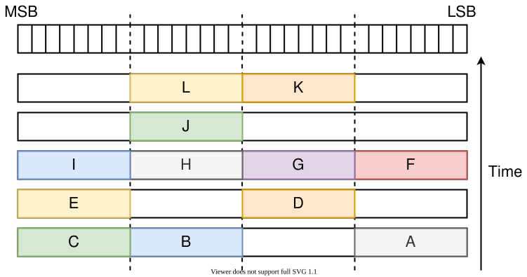
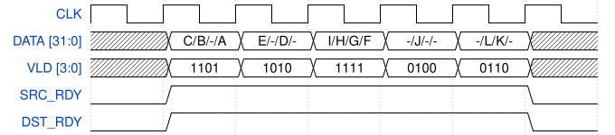
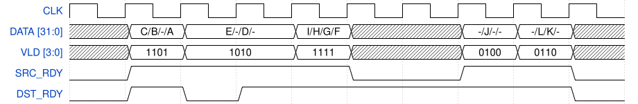

.. _mvb_bus:

MVB Specification
=================
Multi-Value Bus (MVB) has been created as a communication channel able to
process multiple data in one clock cycle. This bus is often used as a separate
channel to transfer fixed length meta-data for the data transmitted on the
:ref:`MFB bus <mfb_bus>`. Therefore both of these buses are often used together
as one communication channel.

Operation
---------
Data are transmitted in units called *words* which consist of the specified
amount of items. The maximum amount of items, which can be transmitted in one
clock cycle, is set during the creation of the bus. Not all items have to
necessary contain valid data, the gap may occur between them. The data always
occupy the whole item.

To simplify the design of components which are participating in the
communication process, the amount of items in the word have to be limited to
specific values. Same rule applies also to the length of the items. Allowed
values depend on the application being used.

Generic parameters
------------------

+------------+---------+---------------+---------------------------------+
| Name       | Type    | Example value | Note                            |
+============+=========+===============+=================================+
| ITEMS      | natural | 4             | Amount of items in a word       |
+------------+---------+---------------+---------------------------------+
| ITEM_WIDTH | natural | 8             | Amount of bits within each item |
+------------+---------+---------------+---------------------------------+

.. note:: The length of a whole word is calculated as `WORD_WIDTH = ITEMS * ITEM_WIDTH`.
          This constant can be used to simplify declarations of some internal signals.

Items are distributed evenly within the word. This is described in bigger detail
in the following picture (word parameters are set according to example values
given in the table above) [1]_:


   Example of the item arrangement within a word

Port description
----------------

+-----------+------------+-------------------------+-------------------------------------------------+
| Port name | Bit length | Direction               | Description                                     |
+===========+============+=========================+=================================================+
| DATA      | WORD_WIDTH | Transmitter -> Receiver | Transmitted data                                |
+-----------+------------+-------------------------+-------------------------------------------------+
| VLD       | ITEMS      | Transmitter -> Receiver | Bit mask indicating validity of each item       |
+-----------+------------+-------------------------+-------------------------------------------------+
| SRC_RDY   | 1          | Transmitter -> Receiver | Asserted when transmitter is ready to send data |
+-----------+------------+-------------------------+-------------------------------------------------+
| DST_RDY   | 1          | Receiver -> Transmitter | Asserted when receiver is ready to accept data  |
+-----------+------------+-------------------------+-------------------------------------------------+

Following examples will be demonstrated on the configuration of `ITEMS = 4` and
`ITEM_WIDTH = 8`. The assertion of a single bit inside the `VLD` signal
signifies that there are valid data being transmitted within the respective
item. On the other hand, the deassertion of a single bit inside the `VLD` signal
stands that there are no valid data within the respective item. The `DATA` value
in such item can be arbitrary.

Examples of various VLD signal values
````````````````````````````````````````
1. The value of `VLD = 1110` means, that three valid items are transmitted in
   current word. Their indexes are 3, 2 and 1.
2. The value of `VLD = 0000` means, that there are no valid items in the
   currently transmitted word (in this case, the `SRC_RDY` signal have to be
   deasserted, see below).
3. The value of `VLD = 0001` means, that there is one valid item being
   transmitted whose index value is 0.

Transmission of the data can take place only when both `SRC_RDY` and `DST_RDY`
signals are asserted. The presence of these signals could be understood as the
application of a simple handshaking mechanism.

.. _mvb-design-considerations:

Design considerations
---------------------
When designing a module with MVB interfaces, some handshaking schemes can
create combinational loops or deadlock the transmission. Others can cause
data loss or duplication. The following rules ensure that such problems don't
occur.

1. A handshake (data transfer between transmitter and receiver) occurs on a
   clock's rising edge when `SRC_RDY` and `DST_RDY` are both high. The receiver must
   accept the data on this clock cycle. The transmitter must provide new data
   the following clock cycle, or deassert `SRC_RDY`.

2. When the offered data are valid (`SRC_RDY=1`), they must remain unchanged until
   received by the receiver driving `DST_RDY` high. Before that happens, `SRC_RDY`
   also must not change value (drop low).

3. The transmitter is not allowed to wait for `DST_RDY=1` before driving
   `SRC_RDY` high. It must provide valid data as soon as it can after the
   previous data were accepted by the receiver. In other words, both
   combinatorial and sequential dependencies of `SRC_RDY` on `DST_RDY` are
   forbidden.

4. There are no limitations on how the receiver may set `DST_RDY`. It can even
   be dependent on `SRC_RDY`; however, this situation must be documented.

5. The above rules apply mainly to a component's input and output MVB
   interfaces. A component may internally deviate from these rules in a
   sensible and justifiable manner, as long as it does not affect its behavior
   to the outside.

6. Any deviations from the rules above must be documented. This also applies to
   any sort of unexpected behavior. Place it either in the description above
   the component or inside its readme.

.. note:: The behavior described in Rule#3 can be achieved in a couple of ways.
          Some examples are: a register at the output enabled by
          `DST_RDY=1 or SRC_RDY=0`, a `(MVB) PIPE <flow/pipe/mvb_pipe.vhd>`_
          with generic `USE_DST_RDY=True`, a :ref:`(MVB) FIFO <mvb_fifox>`, etc.
          However, it would be useful for optimization purposes if there were an
          option to use just a simple, DST_RDY-enabled output register. The
          usage of such goes against this rule but a wise user can utilize it
          for better performance (meeting the timing constraints). Due to this
          reason, it should be disabled by default.

Timing diagrams
---------------
Two timing diagrams will be shown in this section. These diagrams describe how a
MVB transmission is performed in terms of waveforms. Example of MVB
transactions are shown in the following figure:



   Examples of MVB transactions

In next sections, two scenarios will be provided showing how these transactions
can be transferred.

Scenario 1
``````````


|

In this figure all transactions are transmitted consecutively without any idle
or gap. Transmission starts when both `SRC_RDY` and `DST_RDY` are asserted.

Scenario 2
``````````


|

This figure shows how pauses in transmission could be conducted. The first pause
takes place when `DST_RDY` signal is deasserted when data on the bus `DATA` are
still valid. In second case the pause is performed via deassertion of the
`SRC_RDY` signal when data on the `DATA` bus are considered invalid.

.. [1] All bit vectors on this page are aligned from the MSB on the left to the
       LSB on the right. The same numbering is maintained for the items, i.e.
       the left most item has the highest index range whereas the right most has
       the lowest index range.
