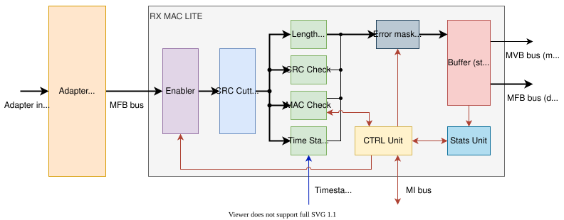

.. _rx_mac_lite:

RX MAC LITE
-----------

This component is used to implement the Ethernet MAC layer on the receiving side.
Thanks to the modular architecture (RX MAC LITE + Adapter), it can be connected to a supported ETH Hard IP block or implement the MAC layer separately.
The implementation may include differences from the Ethernet standard.

Architecture
^^^^^^^^^^^^

RX MAC LITE contains several components that analyze the received frame (CRC, MAC address, length) and check for errors. The Ethernet frame is stored in the buffer (store and forward), if it does not contain errors, it is sent to the output interface along with the metadata, otherwise the frame is discarded. Some of these components are optional. The whole module can be controlled by SW using MI registers (see chapter Register Map).

**Description of RX MAC LITE submodules:**

- **CTRL Unit** - controls the whole module through MI registers
- **Enabler** - enables the receiving of Ethernet frames, if disabled, incoming frames are discarded
- **CRC Cutter** - cuts the CRC of the received Ethernet frame (optional)
- **Length Check** - calculates and checks the length of the received Ethernet frame
- **CRC Check** - checks the CRC of the received Ethernet frame (optional, it is not available in OFM repository, extra license required))
- **MAC Check** - extracts and checks the MAC address of the received Ethernet frame (optional)
- **Time Stamp** - assigns a time stamp to the received Ethernet frame (optional)
- **Error masking** - allows to mask individual errors of the received Ethernet frame
- **Buffer** - store and forward buffer is used to store the received Ethernet frame
- **Stats Unit** - contains statistical counters accessible through MI registers

Adapter
^^^^^^^

The adapter allows you to connect the RX MAC LITE to various variants of the PCS/PMA layer of the Ethernet or various Ethernet Hard IPs.
The main task of the adapter is to convert the selected input bus to the MFB bus.
Currently, several variants of the adapter are implemented:

- **UMII Adapter** - connects Ethernet PCS/PMA layer with MII interface for various speeds (XGMII, XLGMII, CDGMII,...)
- **CMAC Adapter** - connects CMAC Hard IP, which is used in Xilinx UltraScale+ FPGA for 100 Gbps Ethernet (Uses MFB not LBUS!)
- **AVST Adapter** - connects E-Tile Hard IP, which is used in Intel Stratix 10 and Agilex FPGA for up to 100 Gbps Ethernet
- **MAC Segmented Adapter** - connects F-Tile Hard IP, which is used in Intel Agilex FPGA for up to 400 Gbps Ethernet

Register Map
^^^^^^^^^^^^

It is possible to configure RX MAC LITE on the fly, but if you want to make changes atomically, you should disable RX MAC LITE first.
You can set MAC check mode, RX MAC LITE error mask, minimal and maximal frame length.
After you are done you can enable RX MAC LITE.
You can also write all valid MAC addresses into MAC memory, but the MAC memory can be accessed by software only when the RX MAC LITE is disabled!

.. note::

    Statistics counters have a dynamic content.
    For this reason, it is necessary to strobe their actual values at the one moment into the counter registers.
    Software tool is then able to read those registers.

======  ==================================================================
Offset  Name of register
======  ==================================================================
0x000   Counter - Frames total (RFC2819 - etherStatsPkts) - low 32b
0x004   Counter - Frames passed (sent to user logic) - low 32b
0x008   Counter - Frames dropped - low 32b
0x00C   Counter - Frames dropped due to buffer overflow - low 32b
0x010   Counter - Frames total (RFC2819 - etherStatsPkts) - high 32b
0x014   Counter - Frames passed (sent to user logic) - high 32b
0x018   Counter - Frames dropped - high 32b
0x01C   Counter - Frames dropped due to buffer overflow - high 32b
0x020   Enable register
0x024   Error mask register
0x028   Status register
0x02C   Command register
0x030   Minimum frame length allowed (MinTU)
0x034   Maximum frame length allowed (MaxTU/MTU)
0x038   MAC address check mode
0x03C   Counter - Bytes passed (sent to user logic) - low 32b
0x040   Counter - Bytes passed (sent to user logic) - high 32b
0x044   Speed Meter - ticks counter
0x048   Speed Meter - bytes counter
0x04C   Speed Meter - packets counter
0x080   Memory of available MAC addresses (0x080 - 0x0FF)
0x100   Counter - RFC2819 - etherStatsCRCAlignErrors - low 32b
0x104   Counter - Frame with size over configured maximum (MaxTU/MTU) - low 32b
0x108   Counter - Frame with size over configured minimum (MinTU) - low 32b
0x10C   Counter - RFC2819 - etherStatsBroadcastPkts - low 32b
0x110   Counter - RFC2819 - etherStatsMulticastPkts - low 32b
0x114   Counter - RFC2819 - etherStatsFragments - low 32b
0x118   Counter - RFC2819 - etherStatsJabbers - low 32b
0x11C   Counter - RFC2819 - etherStatsOctets (bytes total) - low 32b
0x120   Counter - RFC2819 - etherStatsPkts64Octets (histogram - 64B) - low 32b
0x124   Counter - RFC2819 - etherStatsPkts65to127Octets (histogram - 65-127B) - low 32b
0x128   Counter - RFC2819 - etherStatsPkts128to255Octets (histogram - 128-255B) - low 32b
0x12C   Counter - RFC2819 - etherStatsPkts256to511Octets (histogram - 256-511B) - low 32b
0x130   Counter - RFC2819 - etherStatsPkts512to1023Octets (histogram - 512-1023B) - low 32b
0x134   Counter - RFC2819 - etherStatsPkts1024to1518Octets (histogram - 1024-1518B) - low 32b
0x138   Counter - RFC2819 - etherStatsCRCAlignErrors - high 32b
0x13C   Counter - Frame with size over configured maximum (MaxTU/MTU) - high 32b
0x140   Counter - Frame with size over configured minimum (MinTU) - high 32b
0x144   Counter - RFC2819 - etherStatsBroadcastPkts - high 32b
0x148   Counter - RFC2819 - etherStatsMulticastPkts - high 32b
0x14C   Counter - RFC2819 - etherStatsFragments - high 32b
0x150   Counter - RFC2819 - etherStatsJabbers - high 32b
0x154   Counter - RFC2819 - etherStatsOctets (bytes total) - high 32b
0x158   Counter - RFC2819 - etherStatsPkts64Octets (histogram - 64B) - high 32b
0x15C   Counter - RFC2819 - etherStatsPkts65to127Octets (histogram - 65-127B) - high 32b
0x160   Counter - RFC2819 - etherStatsPkts128to255Octets (histogram - 128-255B) - high 32b
0x164   Counter - RFC2819 - etherStatsPkts256to511Octets (histogram - 256-511B) - high 32b
0x168   Counter - RFC2819 - etherStatsPkts512to1023Octets (histogram - 512-1023B) - high 32b
0x16C   Counter - RFC2819 - etherStatsPkts1024to1518Octets (histogram - 1024-1518B) - high 32b
0x170   Counter - RFC2819 - etherStatsOversizePkts (over 1518B) - low 32b
0x174   Counter - RFC2819 - etherStatsOversizePkts (over 1518B) - high 32b
0x178   Counter - RFC2819 - etherStatsUndersizePkts (below 64B) - low 32b
0x17C   Counter - RFC2819 - etherStatsUndersizePkts (below 64B) - high 32b
0x180   Counter - Frame size histogram (1519-2047B) - low 32b
0x184   Counter - Frame size histogram (1519-2047B) - high 32b
0x188   Counter - Frame size histogram (2048-4095B) - low 32b
0x18C   Counter - Frame size histogram (2048-4095B) - high 32b
0x190   Counter - Frame size histogram (4096-8191B) - low 32b
0x194   Counter - Frame size histogram (4096-8191B) - high 32b
0x198   Counter - Frame size histogram (over 8192B) - low 32b
0x19C   Counter - Frame size histogram (over 8192B) - high 32b
0x1A0   Counter - Frames dropped due to MAC filtered - low 32b
0x1A4   Counter - Frames dropped due to MAC filtered - high 32b
0x1A8   Counter - Frames dropped due to error - low 32b
0x1AC   Counter - Frames dropped due to error - high 32b
0x1B0   Counter - Frames dropped due to MAC disabled - low 32b
0x1B4   Counter - Frames dropped due to MAC disabled - high 32b
0x1B8   Counter - Frames dropped due to error in MII - low 32b
0x1BC   Counter - Frames dropped due to error in MII - high 32b
0x1C0   Counter - Frames dropped due to error in CRC - low 32b
0x1C4   Counter - Frames dropped due to error in CRC - high 32b
0x1C8   Counter - Frames dropped due to error in length - low 32b
0x1CC   Counter - Frames dropped due to error in length - high 32b
======  ==================================================================

**Enable register**

The value stored in this register determines whether the RX MAC LITE unit is enabled or not.

====  ===  =============  ======  ==============
From  To   Name           Access  Description
====  ===  =============  ======  ==============
0     0    Enable         RW      Assert this bit to change the RX MAC LITE status to 'enabled'. Clear this bit to change the RX MAC LITE status to 'disabled'. As soon as the RX MAC LITE status is set to 'enabled' the RX MAC LITE unit starts passed frames to user logic.
1     31   Reserved       R       Reserved bits.
====  ===  =============  ======  ==============

**Error mask register**

This register specifies which controls will be done over incoming frames. The value stored in this register determines which kinds of errors cause the frame discarding.

====  ===  =============  ======  ==============
From  To   Name           Access  Description
====  ===  =============  ======  ==============
0     0    MII_ERROR      RW      This bit signals whether the MII error will cause the frame discarding. Assert this bit to allow frame discarding. Clear this bit to mask this error.
1     1    CRC_ERROR      RW      This bit signals whether the CRC check error will cause the frame discarding. Assert this bit to allow frame discarding. Clear this bit to mask this error.
2     2    MINTU_CHECK    RW      This bit enables the minimum frame length check. If the incoming frame length is less than the RX MAC LITE minimum frame length register, the frame will be discarded.
3     3    MTU_CHECK      RW      This bit enables the MTU frame length check. If the incoming frame length is greater than the RX MAC LITE frame MTU register, the frame will be discarded.
4     4    MAC_CHECK      RW      This bit enables the frame MAC address check. If the incoming frame destination MAC address doesn't pass the control, the frame will be discarded.
5     31   Reserved       R       Reserved bits.
====  ===  =============  ======  ==============

**Status register**

====  ===  =============  ======  ==============
From  To   Name           Access  Description
====  ===  =============  ======  ==============
0     0    MFIFO_OVF      RW      This bit is asserted in case the MFIFO (frame metadata) overflow has occured. Bit reset is performed by writing operation.
1     1    DFIFO_OVF      RW      This bit is asserted in case the DFIFO (frame data) overflow has occured. Bit reset is performed by writing operation.
2     3    DEBUG          RW      Reserved (tied to zero).
4     6    Obsolete       R       Ignore these bits.
7     7    Link Status    R       Information about the link status (0=no link, 1=link ok).
8     21   Reserved       R       Reserved bits.
22    22   INBANDFCS      R       FCS field removing flag (0 → FCS is removed, 1 → FSC isn't removed).
23    27   MAC_COUNT      R       Number of MAC addresses that can be placed into CAM (at most 16).
28    31   Reserved       R       Reserved bits.
====  ===  =============  ======  ==============

**Command register**

====  ===  =============  ======  ==============
From  To   Name           Access  Description
====  ===  =============  ======  ==============
0     7    Command        W       Write a command into this register.
8     31   Reserved       R       Reserved bits.
====  ===  =============  ======  ==============

Command definition:

- 0x01 - CMD STROBE COUNTERS: Writing this constant into the command register will cause that the current frame counters' values will be stored into the frame counter registers at the same moment.
- 0x02 - CMD RESET COUNTERS: Writing this constant into the command register will cause that the frame counters will be reset.
- 0x03 - CMD SWITCH ADDRESS SPACE: Switch the output address space (more information here TODO RFC COUNTERS link)

**Minimum frame length allowed**

This register specifies the minimal frame length allowed (MINTU). The frame length includes the length of Ethernet frame including FCS - according to the XGMII specification it is the length of <data> 32b of XGMII data stream without IFG, preamble, SFD or EFD. Default value is 64.

====  ===  =============  ======  ==============
From  To   Name           Access  Description
====  ===  =============  ======  ==============
0     15   Min. length    RW      The minimal frame length allowed.
16    31   Reserved       R       Reserved bits.
====  ===  =============  ======  ==============

**Maximum frame length allowed**

This register specifies the maximal frame length allowed (MTU). The frame length includes the length of Ethernet frame including FCS - according to the XGMII specification it is the length of <data> 32b of XGMII data stream without IFG, preamble, SFD or EFD. Default value is 64. Default value is 1526.

====  ===  =============  ======  ==============
From  To   Name           Access  Description
====  ===  =============  ======  ==============
0     15   Max. length    RW      The maximal frame length allowed.
16    31   Reserved       R       Reserved bits.
====  ===  =============  ======  ==============

**MAC address check mode**

This register specifies the mode of MAC address checking.

====  ===  =============  ======  ==============
From  To   Name           Access  Description
====  ===  =============  ======  ==============
0     1    Check mode     RW      The MAC address checking mode.
2     31   Reserved       R       Reserved bits.
====  ===  =============  ======  ==============

MAC address checking mode definition:

- 0x00 - MODE 0: All MACs can pass (promiscuous mode).
- 0x01 - MODE 1: Only frames with valid MAC addresses can pass (see MAC memory).
- 0x02 - MODE 2: MODE 1 + All brodcast frames can pass.
- 0x03 - MODE 3: MODE 2 + All multicast frames can pass.

**Memory of available MAC addresses**

This memory contains all available MAC addresses for network interface.

====  ===  =============  ======  ==============
From  To   Name           Access  Description
====  ===  =============  ======  ==============
0     47   MAC address    RW      The MAC address.
48    48   Valid bit      RW      MAC address is valid when asserted.
====  ===  =============  ======  ==============

To write the MAC address item properly you must first write low 32 bits and then high 16 bits.
If you would not do it right way the MAC have not been written.
Memory can contains up to 16 MAC addresses (it depends on MAC_COUNT generic).
Each MAC address is stored on two address positions.
The lower address contains the lower 4 bytes and the upper contains the 2 upper bytes and valid bit.
Only valid MAC addresses are used for matching.

.. warning::

    The MAC memory can be accessed by software only when the RX MAC LITE is disabled!

Ports and Generics
^^^^^^^^^^^^^^^^^^

.. vhdl:autoentity:: RX_MAC_LITE
