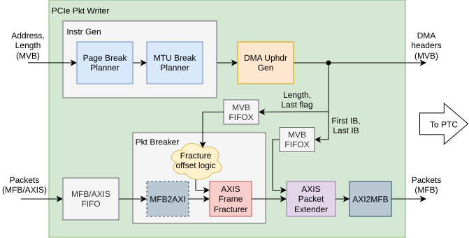

.. Copyright (C) 2025 CESNET z. s. p. o.
.. Author(s): Daniel Kondys <kondys@cesnet.cz>
.. SPDX-License-Identifier: BSD-3-Clause

.. _pcie_pkt_writer:

PCIe Packet Writer
==================

.. vhdl:autoentity:: PCIE_PKT_WRITER

Architecture
------------

.. _ppw_toplevel_diagram_writer:

    Top-level architecture of the PCIe Packet Writer component
