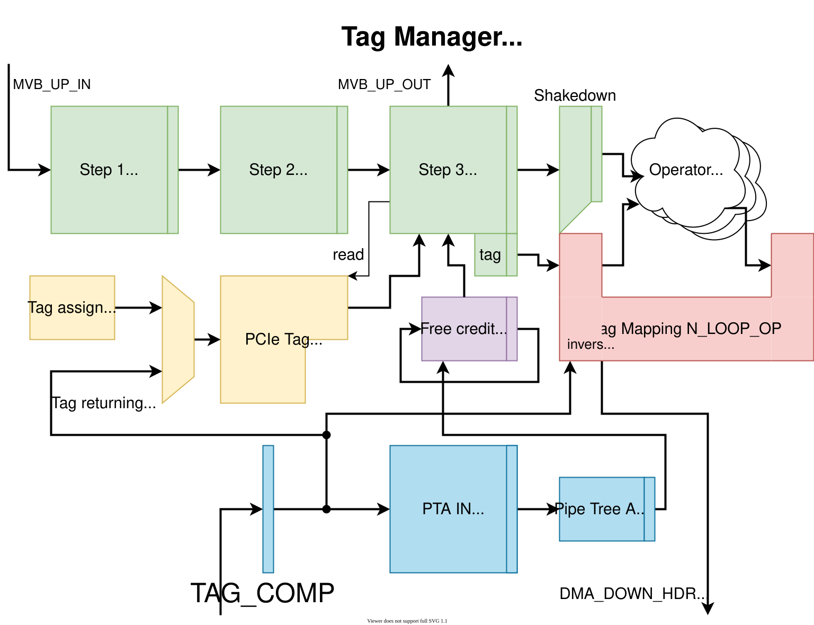

.. _ptc_tag_manager:

PTC Tag Manager
---------------

The purpose of the Tag Manager is to convert between the ID tagging space of the DMA transactions and the ID tagging space of the PCIe transactions.
The DMA tagging consists of a Unit ID (one for each unit which generates requests) and a Tag.
This way, each unit can have its own independent space of transaction Tags.
On the other hand, PCIe transactions require Tags to be unique accross all read requests, which are currently waiting for a response.
The Tag Manager dynamically assigns a free PCIe Tag to each upstream read request and stores the corresponding DMA Unit ID and Tag.
For downstream read responses, the mapping is done the other way around based on the previously stored information.
The Tag Manager is also responsible for freeing of the PCIe Tags, checking of their availability and of the availability of storage space in the downstream MVB+MFB Storage FIFO.
(The MVB+MFB Storage FIFO must be kept from overflowing to prevent fall of DST_RDY on the downstream IP core interface.)

Block diagram
^^^^^^^^^^^^^

The core part of the unit is the Tag mapping memory, which stores the corresponding DMA Tag and Unit ID for each possible PCIe Tag.
Since this memory can be updated multiple times in each cycle, it is built as one memory bank per upstream item, each with its own write port, plus a register array that tracks which bank holds the current mapping of each Tag.

The unit generates the PCIe Tags itself and passes them to the upstream transactions to be propagated to PCIe.
It is also responsible for releasing of the PCIe Tags for repeated usage depending on the downstream transactions.
The architecture is described in the diagram below.

.. note::

    The diagram is out of date: it still draws the Tag mapping as an N_LOOP_OP unit and shows the TAG_ASSIGN interface, both of which have been removed.

.. _ptc_tag_manager_diag_assign:

