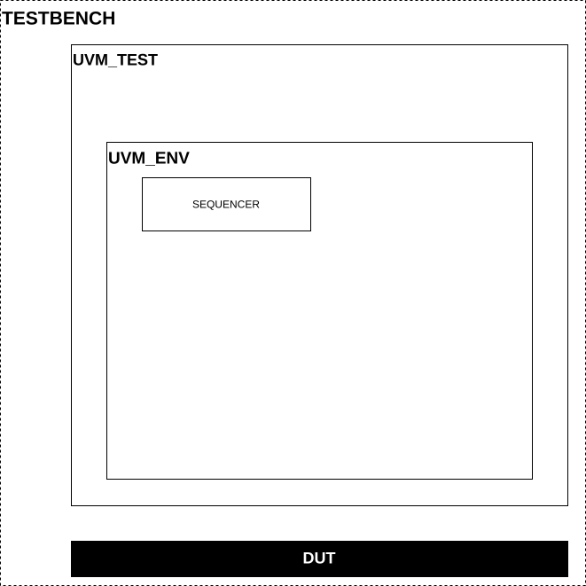
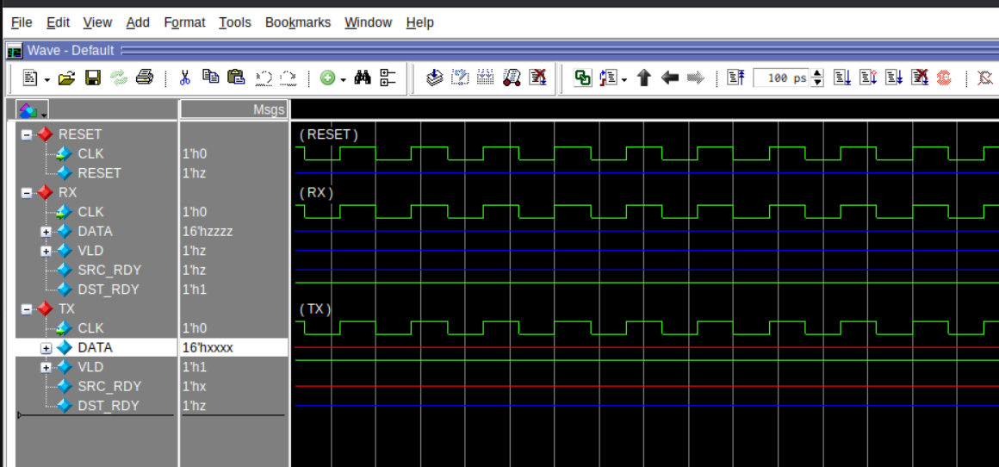
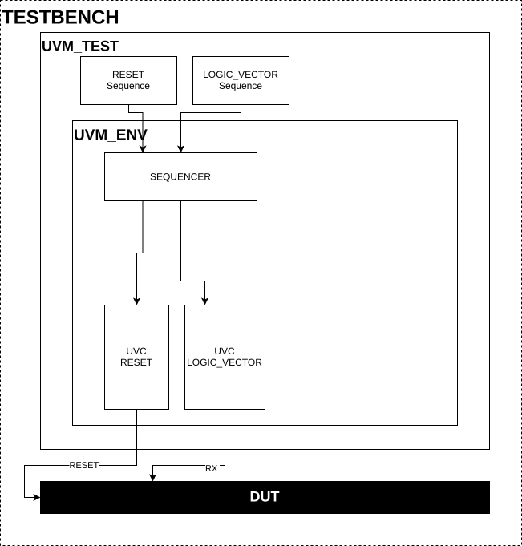
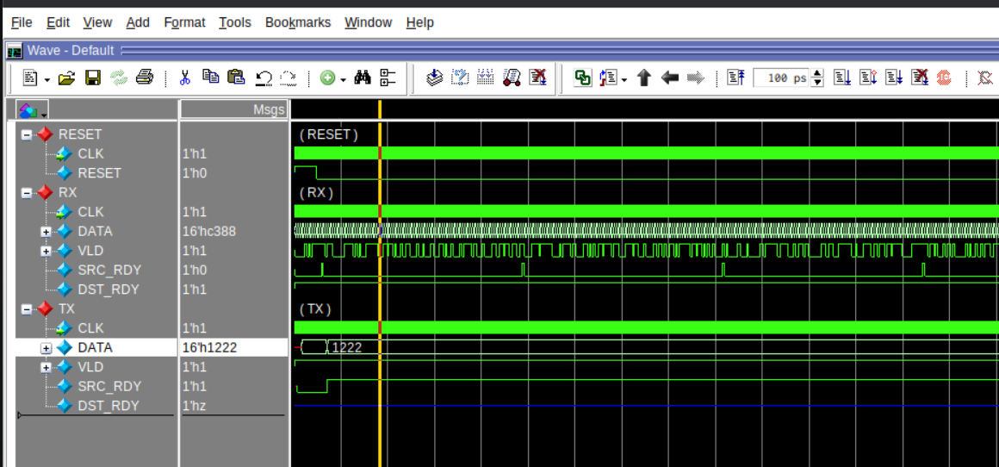
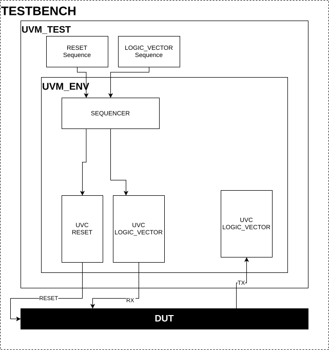
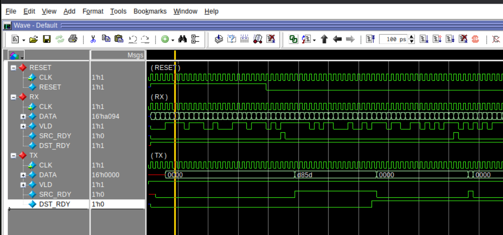
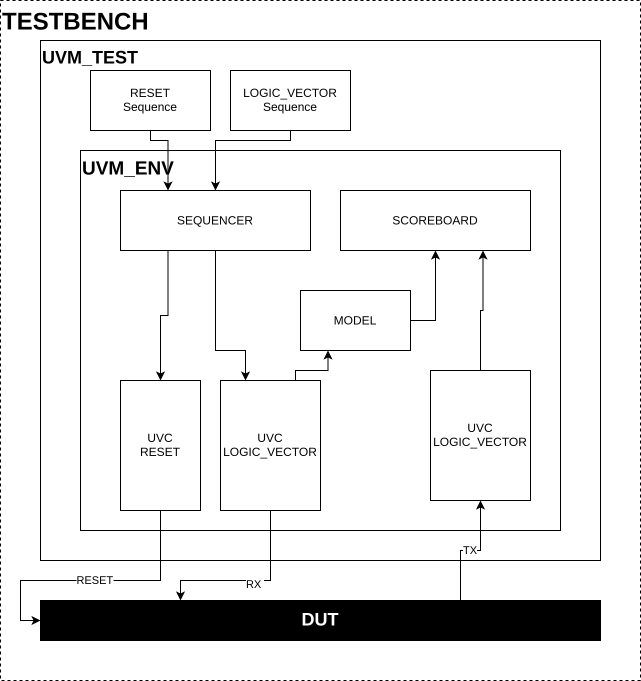

.. howto-first_ver.rst: This document describes how to write first simple verification environment
.. Copyright (C) 2025 CESNET z. s. p. o.
.. Author(s): Radek Iša   <isa@cesnet.cz>
..
.. SPDX-License-Identifier: BSD-3-Clause

.. UVM howto
.. _uvm_howto_first_ver:

*****************************************
UVM HOWTO - Create the first verification
*****************************************

The aim of this document is to describe how to write a simple UVM verification
**step by step**, with full code and file layout.

* **New to UVM in this repo?** Read the :ref:`uvm_howto_intro` first for a
  high-level overview and the meaning of test, environment, UVCs, model, and
  scoreboard.
* For a deeper reference on UVM and the NDK verification environment, see the
  :ref:`uvm_manual`.

==================
Dummy Verification
==================

In this example, we create a simplified verification for component `FIFOX <https://github.com/CESNET/ndk-fpga/tree/devel/comp/base/fifo/fifox>`_
Let's start with dummy verification environment that does nothing. This prepares verification for
next steps. Other components to drive DUT (Design Under Test — the verified VHDL component) interfaces will be added later.
The dummy verification environment will look like this picture. There are a few components which will be extended later.

    The dummy verification environment

|

Start with the file structure. Next to the DUT, create a *uvm* directory and inside it *tbench*.
Inside *tbench* create *env* and *test* (some setups use *tests*). Create the files so the layout matches the list below.

* ./component.vhd
* ./uvm/tbench/env/env.sv
* ./uvm/tbench/env/sequencer.sv
* ./uvm/tbench/env/pkg.sv
* ./uvm/tbench/test/base.sv
* ./uvm/tbench/test/pkg.sv
* ./uvm/tbench/generic.sv
* ./uvm/Modules.tcl
* ./uvm/top_level.fdo
* ./uvm/signals.fdo

----

------------------
Create environment
------------------

We start with a minimal environment containing only the virtual sequencer (see :ref:`uvm_howto_intro`, The big picture).
Later we add RX/TX UVCs, model, and scoreboard. Some classes are parametrised (e.g. *env*), similar to C++ templates.

.. code-block:: systemverilog
   :caption: env/env.sv

    class env #(
        int unsigned DATA_WIDTH
    ) extends uvm_env;
        `uvm_component_param_utils(uvm_fifox::env #(DATA_WIDTH));

        // Virtual sequencer
        sequencer #(DATA_WIDTH) m_sequencer;

        // Constructor
        function new(string name, uvm_component parent = null);
            super.new(name, parent);
        endfunction

        // check if in environment is some pending data
        function int unsigned used();
            int unsigned ret = 0;
            return ret;
        endfunction

        // Create base components of environment.
        function void build_phase(uvm_phase phase);

            //Call parents function build_phase
            super.build_phase(phase);

            // Create sequencer
            m_sequencer = sequencer #(DATA_WIDTH)::type_id::create("m_sequencer", this);
        endfunction

        // Connect agent's ports with ports from scoreboard.
        function void connect_phase(uvm_phase phase);
        endfunction
    endclass

The virtual sequencer collects other sequencers to simplify cooperation between sequences.
When adding UVCs into the environment we should add the sequencer from the UVC to the virtual sequencer
associated with the environment.
Now the virtual sequencer is just empty class. Later we add RX sequencer.

.. code-block:: systemverilog
   :caption: env/sequencer.sv

    class sequencer #(
        int unsigned DATA_WIDTH
    ) extends uvm_sequencer;
        `uvm_component_param_utils(uvm_fifox::sequencer #(DATA_WIDTH))

        function new(string name, uvm_component parent);
            super.new(name, parent);
        endfunction
    endclass

The last thing in the environment is to create a package file.
Package simplifies organization of files and classes into namespace.

.. code-block:: systemverilog
   :caption: env/pkg.sv

    `ifndef FIFOX_ENV_SV
    `define FIFOX_ENV_SV
    package uvm_fifox;
        `include "uvm_macros.svh"
        import uvm_pkg::*;

        `include "sequencer.sv"
        `include "env.sv"
    endpackage
    `endif

-----------
Create test
-----------

Create a test class that builds the environment and, in *run_phase*, raises an objection, starts sequences,
waits for work to finish, then drops the objection so simulation can end (see :ref:`uvm_howto_intro`, The big picture).
Function *used* indicates whether the scoreboard is still waiting for DUT data.

.. code-block:: systemverilog
   :caption: test/base.sv

    class base#(
        int unsigned DATA_WIDTH
    ) extends uvm_test;
        uvm_component_registry #(test::base#(DATA_WIDTH), "test::base") type_id;

        // test have to create top level environment
        uvm_fifox::env #(DATA_WIDTH) m_env;

        function new(string name, uvm_component parent = null);
            super.new(name, parent);
        endfunction

        function void build_phase(uvm_phase phase);
            m_env = uvm_fifox::env #(DATA_WIDTH)::type_id::create("m_env", this);
        endfunction

        // ------------------------------------------------------------------------
        // run sequences on their sequencers
        virtual task run_phase(uvm_phase phase);
            time time_end;

            // Rise objection
            phase.raise_objection(this);

            #(100us);

            // Wait for transactions to leave DUT
            time_end = $time + 1000us;
            while ($time < time_end && m_env.used() == 1) begin
                #(500ns);
            end

            // drop objection
            phase.drop_objection(this);
        endtask

        function void report_phase(uvm_phase phase);
            `uvm_info(this.get_full_name(), {"\n\tTEST : ", this.get_type_name(), " END\n"}, UVM_NONE);
        endfunction
    endclass

Create the test package. This package creates the test namespace.

.. code-block:: systemverilog
   :caption: test/pkg.sv

    `ifndef FIFOX_TEST_SV
    `define FIFOX_TEST_SV
    package test;
        `include "uvm_macros.svh"
        import uvm_pkg::*;

        `include "base.sv"
    endpackage
    `endif

----------------
Create testbench
----------------

The testbench instantiates the DUT and interfaces. In the *initial* block you register each
interface in the config database (so UVCs can find it), then call *run_test()* and *$stop(2)*.
See :ref:`uvm_howto_intro` (Configuration database) for the name-matching rule. This example uses
*logic_vector_mvb* to adapt the FIFO interface to MVB.
In our UVC is not interface for common FIFO interface. We could create one or we can
used one of the existing with slight adjustents/conversions. Opting for the second option,
we convert signals between the FIFO and MVB interface.

.. code-block:: systemverilog
   :caption: testbench.sv

    import uvm_pkg::*;
    `include "uvm_macros.svh"
    import uvm_generic::*;

    module testbench;
        // Register test with parameters in UVM factory.
        typedef test::base#(uvm_generic::DATA_WIDTH) base;

        // Create clock
        logic CLK = 0;
        always #(CLK_PERIOD/2) CLK = ~CLK;

        reset_if reset (CLK);
        mvb_if #(1, DATA_WIDTH)     mvb_rx    (CLK);
        mvb_if #(1, DATA_WIDTH)     mvb_tx    (CLK);

       initial begin
            uvm_root m_root;

            // REGISTER INTERFACE INTO DATABASE
            uvm_config_db #(virtual reset_if)::set(null, "", "vif_reset", reset);
            uvm_config_db #(virtual mvb_if #(1, DATA_WIDTH))    ::set(null, "", "vif_mvb_rx",     mvb_rx    );
            uvm_config_db #(virtual mvb_if #(1, DATA_WIDTH))    ::set(null, "", "vif_mvb_tx",     mvb_tx    );

            // stop on end of simulation and dont print message ILLEGALNAME
            m_root = uvm_root::get();
            m_root.finish_on_completion = 0;
            m_root.set_report_id_action_hier("ILLEGALNAME", UVM_NO_ACTION);

            // dont record transactions
            uvm_config_db #(int)            ::set(null, "", "recording_detail", 0);
            uvm_config_db #(uvm_bitstream_t)::set(null, "", "recording_detail", 0);

            // RUN TESTS
            run_test();
            // STOP ON END OF SIMULATION
            $stop(2);
        end

        // Instantiate DUT or other VHDL architectures
        logic full;
        logic empty;
        FIFOX #(
            .DATA_WIDTH          (uvm_generic::DATA_WIDTH         ),
            .ITEMS               (uvm_generic::ITEMS              ),
            .RAM_TYPE            (uvm_generic::RAM_TYPE           ),
            .DEVICE              (uvm_generic::DEVICE             ),
            .ALMOST_FULL_OFFSET  (uvm_generic::ALMOST_FULL_OFFSET ),
            .ALMOST_EMPTY_OFFSET (uvm_generic::ALMOST_EMPTY_OFFSET),
            .FAKE_FIFO           (uvm_generic::FAKE_FIFO          )
        ) VHDL_DUT_U (

            .CLK   (CLK),
            .RESET (RST),

            .DI     (mvb_rx.DATA),
            // Write only when valid data is on the bus.
            .WR     (mvb_rx.SRC_RDY & mvb_rx.VLD[0]),
            .FULL   (full),
            .AFULL  (),
            .STATUS (),

            .DO     (mvb_tx.DATA   ),
            .RD     (mvb_tx.DST_RDY),
            .EMPTY  (empty         ),
            .AEMPTY ()

        );
        assign mvb_rx.DST_RDY = ~full;
        assign mvb_tx.SRC_RDY = ~empty;
        // There is only one item which is always
        // valid when SRC_RDY is set. Valid is indicated by
        // signal SRC_RDY.
        assign mvb_tx.VLD     = '1;
    endmodule

Clock generation (commonly in the testbench):

.. code-block:: systemverilog
   :caption: CLOCK GENERATING

    // Create clock
    logic CLK = 0;
    always #(CLK_PERIOD/2) CLK = ~CLK;

Interface registration (names must match UVC config; see intro):

.. code-block:: systemverilog
   :caption: registration interface

    uvm_config_db #(virtual reset_if)::set(null, "", "vif_reset", reset);
    uvm_config_db #(virtual mvb_if #(1, DATA_WIDTH))    ::set(null, "", "vif_mvb_rx",     mvb_rx    );
    uvm_config_db #(virtual mvb_if #(1, DATA_WIDTH))    ::set(null, "", "vif_mvb_tx",     mvb_tx    );

Run the test and stop simulation:

.. code-block:: systemverilog
   :caption: run the test

   // RUN TESTS
   run_test();
   // STOP ON END OF SIMULATION
   $stop(2);

--------------------------
Create parameters package
--------------------------

Put DUT generic parameters in a package so the verification can mirror them and run all relevant combinations.
The snippet below mirrors the FIFO generics and adds *CLK_PERIOD*.

.. code-block:: systemverilog
   :caption: generic.sv

    package uvm_generic;
        parameter int unsigned DATA_WIDTH          = 64;
        parameter int unsigned ITEMS               = 16;
        parameter string       RAM_TYPE            = "AUTO";
        parameter string       DEVICE              = "ULTRASCALE";
        parameter int unsigned ALMOST_FULL_OFFSET  = 0;
        parameter int unsigned ALMOST_EMPTY_OFFSET = 0;
        parameter int unsigned FAKE_FIFO           = 0;

        parameter time CLK_PERIOD = 4ns;
    endpackage

-----------------------
Create required scripts
-----------------------

Scripts automatization of package compilation, setup verification and
run the verification.
There are four important scripts.

* *Modules.tcl*     - This file is used for adding verification dependencies
* *top_level.fdo*   - Top-level file to launch the simulation: *vsim -do top_level.fdo* (add *-c* for command line without GUI)
* *signals.fdo*     - This file contains signals that are shown in the waveform.
* *ver_settings.py* - This file is for the multiver script. Run verification with different parameters. Not important at this time.

Script *Modules.tcl* takes care of verification files and their dependencies.
You can see there, three types of variables

* *PACKAGES*   - Simple one file dependecies (Packages)
* *COMPONENTS* - local files dependencies (NDK's UVC). Commonly in <NDK-root-dir>/comp/uvm
* *MOD*        - Local files (tbench files)

.. code-block:: tcl
   :caption: Modules.tcl

    lappend COMPONENTS [ list "SV_LV_MVB_BASE"      "$OFM_PATH/comp/uvm/logic_vector_mvb"         "FULL"]
    lappend COMPONENTS [ list "SV_RESET_BASE"       "$OFM_PATH/comp/uvm/reset"                    "FULL"]

    lappend MOD "$ENTITY_BASE/tbench/env/pkg.sv"
    lappend MOD "$ENTITY_BASE/tbench/test/pkg.sv"
    lappend MOD "$ENTITY_BASE/tbench/generic.sv"
    lappend MOD "$ENTITY_BASE/tbench/testbench.sv"

*top_level.fdo* starts the simulation. Set *SIM_FLAGS(UVM_TEST)* to your test name (e.g. ``"test::base"``);
*SIM_FLAGS(DEBUG)* enables waveforms, *SIM_FLAGS(UVM_VERBOSITY)* controls log detail. See the script comments for seed and other options.

.. code-block:: tcl
   :caption: top_level.fdo

    # PATH TO OFM
    set FIRMWARE_BASE ../../../../../ndk-fpga

    # TOP LEVEL SIMULATION FILE
    set TB_FILE               "./tbench/testbench.sv"
    # FILE WITH SIGNALS (NOT REQUIRED)
    # set SIG_FILE              "./signals.fdo"

    # PATH TO DIRECTORY WITH file Modules.tcl for Design under test (component)
    lappend COMPONENTS [list "DUT"     ".."    "FULL"  ]
    # PATH TO DIRECTORY WITH file Modules.tcl for verification
    lappend COMPONENTS [list "DUT_UVM" "."     "FULL"  ]

    # Enable Code Coverage
    # set SIM_FLAGS(CODE_COVERAGE) true
    # Enable UVM verification
    set SIM_FLAGS(UVM_ENABLE) true

    # Set test which is going to be run
    set SIM_FLAGS(UVM_TEST) "test::base"
    #set SIM_FLAGS(UVM_TEST) "test::base_extended"

    # set verbosity level if you want messages UVM_NONE, UVM_LOW, UVM_MEDIUM, UVM_HIGH, UVM_FULL, UVM_DEBUG
    set SIM_FLAGS(UVM_VERBOSITY) UVM_NONE

    # set debug if needed for debugging
    # set to false when you put it into git
    set SIM_FLAGS(DEBUG) true

    # set rand seed if needed for debugging
    # set SIM_FLAGS(RAND_SEED) 143493821

    # Global include file for compilation
    source "$FIRMWARE_BASE/build/Modelsim.inc.fdo"

    # Suppress warnings from numeric and arithmetic libraries
    puts "Numeric Std Warnings - Disabled"
    set NumericStdNoWarnings 1
    puts "Std Arith Warnings - Disabled"
    set StdArithNoWarnings 1

    # RUN SIMULATION
    nb_sim_run
    ## restart simulation if needed
    ## in the vsim command interface, you can use the following command to restart
    ## the verification without building it again (optional, to save some time).
    # nb_sim_restart

*signals.fdo* adds signals to the waveform (paths start with ``/testbench/``).

.. code-block:: tcl
   :caption: signals.fdo

    # add signals

    add wave -noupdate -group "RESET" "/testbench/reset/*"
    add wave -noupdate -group "RX"    "/testbench/mvb_rx/*"
    add wave -noupdate -group "TX"    "/testbench/mvb_tx/*"

--------------
Run First test
--------------

Run the verification: ``vsim -do top_level.fdo`` (or ``vsim -do top_level.fdo -c`` for command line without GUI).
The same command is used for all following steps; only the results change.

You can now run the verification and observe the signals in a waveform.
As you can see in the picture, there isn't any data sent to the DUT. This first implementation does nothing.
In the next chapters we will add UVCs to start generating and observing signals.

    Waveform displaying run of the dummy verification environment

----

----------
UVM PHASES
----------

UVM components run in phases (e.g. *build_phase*, *connect_phase*, *run_phase*); you see them in
*env.sv* and *test.sv*. For an overview of what each phase does, see :ref:`uvm_howto_intro` (UVM concepts — Phases).
Not every component implements every phase; for example, the NDK agents commonly don't implement *check_phase*.

----

========================
Drive RX Input and Reset
========================

Add stimulus by integrating existing NDK UVCs: *uvm_reset::agent* and *uvm_logic_vector_mvb::env_rx*.
We map the FIFO’s simple interface (data, WR, full / data, RD, empty) to MVB and use *reset* for the reset signal.
In *build_phase* you create config objects and the UVC instances; in *connect_phase* you connect reset sync and the virtual sequencer. RX UVC drives the DUT input; for custom sequences see :ref:`uvm_howto_extend_verification`.

    Add RX input and reset to the dummy verification environment

|

Extends verification environment by adding UVCs *uvm_logic_vector_mvb::env_rx*
and *uvm_reset::agent*.

.. code-block:: systemverilog
   :caption: env/env.sv

    class env #(
        int unsigned DATA_WIDTH
    ) extends uvm_env;
        `uvm_component_param_utils(uvm_fifox::env #(DATA_WIDTH));

        // Virtual sequencer
        sequencer #(DATA_WIDTH) m_sequencer;

        // RESET interface
        protected uvm_reset::agent m_reset;
        // RX environments
        protected uvm_logic_vector_mvb::env_rx #(1, DATA_WIDTH) m_rx;

        // Constructor
        function new(string name, uvm_component parent = null);
            super.new(name, parent);
        endfunction

        function int unsigned used();
            int unsigned ret = 0;
            return ret;
        endfunction

        // Create base components of environment.
        function void build_phase(uvm_phase phase);
            uvm_reset::config_item m_cfg_reset;
            uvm_logic_vector_mvb::config_item m_cfg_rx;

            //Call parents function build_phase
            super.build_phase(phase);

            //Create reset environment
            m_cfg_reset                = new;
            m_cfg_reset.active         = UVM_ACTIVE;   // Activly driven environment
            // interface register name have to be same in testbench uvm_config_db#(...)::set();
            m_cfg_reset.interface_name = "vif_reset";
            uvm_config_db #(uvm_reset::config_item)::set(this, "m_reset", "m_config", m_cfg_reset);
            // Creation of the reset
            m_reset = uvm_reset::agent::type_id::create("m_reset", this);

            // Configuration of the m_rx
            m_cfg_rx                = new;
            m_cfg_rx.active         = UVM_ACTIVE;
            // interface register name has to be same in testbench uvm_config_db#(...)::set();
            m_cfg_rx.interface_name = "vif_mvb_rx";
            uvm_config_db #(uvm_logic_vector_mvb::config_item)::set(this, "m_rx", "m_config", m_cfg_rx);
            // Creation of the m_rx
            m_rx = uvm_logic_vector_mvb::env_rx #(1, DATA_WIDTH)::type_id::create("m_rx", this);

            // Create sequencer
            m_sequencer = sequencer #(DATA_WIDTH)::type_id::create("m_sequencer", this);
        endfunction

        // Connect agent's ports with ports from scoreboard.
        function void connect_phase(uvm_phase phase);
            // Connection of the reset
            m_reset.sync_connect(m_rx.reset_sync);

            // Connect sequencer
            m_sequencer.m_reset = m_reset.m_sequencer;
            m_sequencer.m_rx    = m_rx.m_sequencer;
        endfunction
    endclass

Add sequencers *reset* and *uvm_logic_vector* into the virtual sequencer. Virtual sequencer
associates RX sequencer to simplify cooperation between sequences. Sequences generate
input transactions to the dut. Here we generated high-level transactions.

.. code-block:: systemverilog
   :caption: env/sequencer.sv

    class sequencer #(
        int unsigned DATA_WIDTH
    ) extends uvm_sequencer;
        `uvm_component_param_utils(uvm_fifox::sequencer #(DATA_WIDTH))

        // reset sequencer
        uvm_reset::sequencer m_reset;
        // rx sequencer
        uvm_logic_vector::sequencer #(DATA_WIDTH)    m_rx;

        function new(string name, uvm_component parent);
            super.new(name, parent);
        endfunction
    endclass

Run sequence *uvm_reset::sequence_start* and *uvm_logic_vector::sequence_simple* in the test.
Sequence *uvm_reset::sequence_start* resets the DUT at the start of verification, then after a while sets
reset low until end of simulation. Sequence *uvm_logic_vector::sequence_simple* generates
data to the FIFO input. The generated data is sent to the DUT input.
If we want to run two sequences at the same time we have to create two parallel tasks.
The **fork** command creates new threads and executes tasks. **fork** can be terminated by three
commands:

* **join**      — to continue, all tasks have to terminate
* **join_any**  — to continue, one task has to terminate
* **join_none** — to continue, no task has to terminate

In our case we want the code to continue when the sequence that generates input
data has stopped. Using *join* would not work because the reset sequence never stops.

.. code-block:: systemverilog
   :caption: test/base.sv

    class base#(
        int unsigned DATA_WIDTH
    ) extends uvm_test;
        uvm_component_registry #(test::base#(DATA_WIDTH), "test::base") type_id;

        // test has to create top-level environment
        uvm_fifox::env #(DATA_WIDTH) m_env;

        function new(string name, uvm_component parent = null);
            super.new(name, parent);
        endfunction

        function void build_phase(uvm_phase phase);
            m_env = uvm_fifox::env #(DATA_WIDTH)::type_id::create("m_env", this);
        endfunction

        //------------------------------------------------------------------------
        // run sequences on their sequencers
        virtual task run_phase(uvm_phase phase);
            time time_end;

            phase.raise_objection(this);

            fork

                // Reset DUT
                begin
                    uvm_reset::sequence_start seq_rst;

                    seq_rst = uvm_reset::sequence_start::type_id::create("seq_rst", this);
                    assert(seq_rst.randomize()) else `uvm_fatal(this.get_full_name(), "\n\tCannot randomize reset sequence");
                    seq_rst.start(m_env.m_sequencer.m_reset);
                end

                // Start RX sequence. Generating input
                begin
                    uvm_logic_vector::sequence_simple #(DATA_WIDTH) seq_rx;

                    seq_rx = uvm_logic_vector::sequence_simple #(DATA_WIDTH)::type_id::create("seq_rx", this);
                    assert(seq_rx.randomize()) else `uvm_fatal(this.get_full_name(), "\n\tCannot randomize RX sequence");
                    seq_rx.start(m_env.m_sequencer.m_rx);
                end
            join_any

            #(100us);

            // Wait for all transactions to leave the DUT
            time_end = $time + 1000us;
            while ($time < time_end && m_env.used() == 1) begin
                #(500ns);
            end

            phase.drop_objection(this);

        endtask

        function void report_phase(uvm_phase phase);
            `uvm_info(this.get_full_name(), {"\n\tTEST : ", this.get_type_name(), " END\n"}, UVM_NONE);
        endfunction
    endclass

--------
Run test
--------

Run the verification (same command as in **Run First test**: ``vsim -do top_level.fdo``). You should see input on the RX interface in the waveform.

    Waveform displaying change when RX and reset are driven

|

Note that for the first few clock cycles the DUT is in reset and the verification sends transactions to the
RX interface. Because we did not instantiate the TX UVC yet, there is no communication
through the TX interface. As you can see the signal DST_RDY on the TX side is in high impedance.

If there is unmatched data from the model at the end of verification, the comparators assume the DUT has
gotten stuck.

----

--------
NDK UVCs
--------

NDK UVCs (in *comp/uvm/*) simplify verification by providing ready-made conversions between high-level transactions and
NDK interfaces. For a quick list of the most important UVCs (reset, logic_vector_mvb, mi,
common, etc.) see the :ref:`uvm_howto_intro` (Quick reference). For the full list of low-level and
high-level agents, converting UVCs, and supporting UVCs, see the :ref:`uvm_manual`. Interface names
in the testbench ``uvm_config_db::set`` must match the UVC configuration (see intro, Configuration database).

----

========
Drive TX
========

Add *uvm_logic_vector_mvb::env_tx* to the environment. It drives *DST_RDY* (FIFO read) so the FIFO can be read, and monitors DUT output for the scoreboard in the next step.

    Add TX driver into the verification environment

|

.. code-block:: systemverilog
   :caption: env/env.sv

    class env #(
        int unsigned DATA_WIDTH
    ) extends uvm_env;
        `uvm_component_param_utils(uvm_fifox::env #(DATA_WIDTH));

        // Virtual sequencer
        sequencer #(DATA_WIDTH) m_sequencer;

        // RESET interface
        protected uvm_reset::agent m_reset;
        // RX environments
        protected uvm_logic_vector_mvb::env_rx #(1, DATA_WIDTH) m_rx;
        // TX environments
        protected uvm_logic_vector_mvb::env_tx #(1, DATA_WIDTH) m_tx;

        // Constructor
        function new(string name, uvm_component parent = null);
            super.new(name, parent);
        endfunction

        function int unsigned used();
            int unsigned ret = 0;
            return ret;
        endfunction

        // Create base components of environment.
        function void build_phase(uvm_phase phase);
            uvm_reset::config_item m_cfg_reset;
            uvm_logic_vector_mvb::config_item m_cfg_rx;
            uvm_logic_vector_mvb::config_item m_cfg_tx;

            //Call parents function build_phase
            super.build_phase(phase);

            //Create reset environment
            m_cfg_reset                = new;
            m_cfg_reset.active         = UVM_ACTIVE;   // Activly driven environment
            // interface register name have to be same in testbench uvm_config_db#(...)::set();
            m_cfg_reset.interface_name = "vif_reset";
            uvm_config_db #(uvm_reset::config_item)::set(this, "m_reset", "m_config", m_cfg_reset);
            // Creation of the reset
            m_reset = uvm_reset::agent::type_id::create("m_reset", this);

            // Configuration of the m_rx
            m_cfg_rx                = new;
            m_cfg_rx.active         = UVM_ACTIVE;
            // interface register name have to be same in testbench uvm_config_db#(...)::set();
            m_cfg_rx.interface_name = "vif_mvb_rx";
            uvm_config_db #(uvm_logic_vector_mvb::config_item)::set(this, "m_rx", "m_config", m_cfg_rx);
            // Creation of the m_rx
            m_rx = uvm_logic_vector_mvb::env_rx #(1, DATA_WIDTH)::type_id::create("m_rx", this);

            // Configuration of the m_tx
            m_cfg_tx                = new;
            m_cfg_tx.active         = UVM_ACTIVE;
            // interface register name have to be same in testbench uvm_config_db#(...)::set();
            m_cfg_tx.interface_name = "vif_mvb_tx";
            uvm_config_db #(uvm_logic_vector_mvb::config_item)::set(this, "m_tx", "m_config", m_cfg_tx);
            // Creation of the m_tx
            m_tx = uvm_logic_vector_mvb::env_tx #(1, DATA_WIDTH)::type_id::create("m_tx", this);

            // Create sequencer
            m_sequencer = sequencer #(DATA_WIDTH)::type_id::create("m_sequencer", this);
        endfunction

        // Connect agent's ports with ports from scoreboard.
        function void connect_phase(uvm_phase phase);
            // Connection of the reset
            m_reset.sync_connect(m_rx.reset_sync);
            m_reset.sync_connect(m_tx.reset_sync);

            // Connect sequencer
            m_sequencer.m_reset = m_reset.m_sequencer;
            m_sequencer.m_rx    = m_rx.m_sequencer;
        endfunction
    endclass

--------
Run test
--------

Run the verification (same command as in **Run First test**: ``vsim -do top_level.fdo``). You should see DST_RDY driven on the TX side and data accepted by the verification environment; check the waveform to confirm the TX interface is driven.

    Waveform displaying change when the TX interface are driven

|

----

========================
Model and Scoreboard
========================

    Add scoreboard and model to the verification

|

The model produces expected transactions from the same inputs as the DUT; the scoreboard compares them to DUT outputs
(see :ref:`uvm_howto_intro`, Model and scoreboard). For our FIFO, order is preserved so we use *uvm_common::comparer_ordered*.
The code below shows the scoreboard (with *report_phase* printing **VERIFICATION SUCCESS** or **VERIFICATION FAILED**) and the model (a simple pass-through for the FIFO). For different model vs DUT transaction types, override *compare* in the comparer. Automatic testing looks for **VERIFICATION SUCCESS** in the transcript; see :ref:`uvm_howto_others`.

.. code-block:: systemverilog
   :caption: env/scoreboard.sv

    class scoreboard #(
        int unsigned DATA_WIDTH
    ) extends uvm_scoreboard;
        `uvm_component_utils(uvm_fifox::scoreboard #(DATA_WIDTH))

        // Transaction comparator
        uvm_common::comparer_ordered #(uvm_logic_vector::sequence_item #(DATA_WIDTH)) cmp;

        // Contructor of scoreboard.
        function new(string name, uvm_component parent = null);
            super.new(name, parent);
        endfunction

        // return 1 when there si no error otherwise 0
        function int unsigned success();
            int unsigned ret = 1;
            ret &= cmp.success();
            return ret;
        endfunction

        // return 1 when waiting for some transactions from DUT
        function int unsigned used();
            int unsigned ret = 0;
            ret |= cmp.used();
            return ret;
        endfunction

        function void build_phase(uvm_phase phase);
            // Create scoreboard
            cmp = uvm_common::comparer_ordered #(uvm_logic_vector::sequence_item #(DATA_WIDTH))::type_id::create("cmp", this);
        endfunction

        function void report_phase(uvm_phase phase);
            string msg = "\n";
            if (this.success() && this.used() == 0) begin
                `uvm_info(get_type_name(), {msg, "\n\n\t---------------------------------------\n\t----     VERIFICATION SUCCESS      ----\n\t---------------------------------------"}, UVM_NONE)
            end else begin
                `uvm_info(get_type_name(), {msg, "\n\n\t---------------------------------------\n\t----     VERIFICATION FAILED       ----\n\t---------------------------------------"}, UVM_NONE)
            end
        endfunction
    endclass

The model creates a predicted output transaction from an input transaction. An input transaction is
commonly generated in a sequence. Then it is sent to the DUT and the Model.
The DUT is a FIFO, so it does not change the input transaction and sends it directly to the output.
So the model does the same: it only forwards data to the output and does not make any changes.

.. code-block:: systemverilog
   :caption: env/model.sv

    class model #(
        int unsigned DATA_WIDTH
    ) extends uvm_scoreboard;
        `uvm_component_utils(uvm_fifox::model #(DATA_WIDTH))

        // port for input data
        uvm_tlm_analysis_fifo#(uvm_logic_vector::sequence_item#(DATA_WIDTH)) m_rx;
        // port for output data
        uvm_analysis_port    #(uvm_logic_vector::sequence_item#(DATA_WIDTH)) m_tx;

        function new(string name, uvm_component parent = null);
            super.new(name, parent);
            m_rx = new("m_rx", this);
            m_tx = new("m_tx", this);
        endfunction

        function int unsigned used();
            int unsigned ret = 0;
            ret |= (m_rx.used() != 0);
            return ret;
        endfunction

        task run_phase(uvm_phase phase);
            uvm_logic_vector::sequence_item#(DATA_WIDTH) data;

            forever begin
                //get data from input queue
                m_rx.get(data);
                // print data when SIM_FLAGS(UVM_VERBOSITY) UVM_HIGH
                `uvm_info(this.get_full_name(), $sformatf("\n\tModel get transaction%s", data.convert2string()), UVM_HIGH);
                // Process data (FIFO don't change data)

                // send data to output port
                m_tx.write(data);
            end
        endtask
    endclass

Add the model and the scoreboard into the environment

.. code-block:: systemverilog
   :caption: env/env.sv

    class env #(
        int unsigned DATA_WIDTH
    ) extends uvm_env;
        `uvm_component_param_utils(uvm_fifox::env #(DATA_WIDTH));

        // Virtual sequencer
        sequencer #(DATA_WIDTH) m_sequencer;

        // RESET interface
        protected uvm_reset::agent m_reset;
        // RX environments
        protected uvm_logic_vector_mvb::env_rx #(1, DATA_WIDTH) m_rx;
        // TX environments
        protected uvm_logic_vector_mvb::env_tx #(1, DATA_WIDTH) m_tx;

        // Scoreboard
        protected scoreboard #(DATA_WIDTH) m_sc;
        // Model instance
        protected uvm_fifox::model #(DATA_WIDTH) m_model;

        // Constructor
        function new(string name, uvm_component parent = null);
            super.new(name, parent);
        endfunction

        function int unsigned used();
            int unsigned ret = 0;
            ret |= (m_model.used() != 0);
            ret |= (m_sc.used() != 0);
            return ret;
        endfunction

        // Create base components of environment.
        function void build_phase(uvm_phase phase);
            uvm_reset::config_item m_cfg_reset;
            uvm_logic_vector_mvb::config_item m_cfg_rx;
            uvm_logic_vector_mvb::config_item m_cfg_tx;

            //Call parents function build_phase
            super.build_phase(phase);

            //Create reset environment
            m_cfg_reset                = new;
            m_cfg_reset.active         = UVM_ACTIVE;   // Activly driven environment
            // interface register name have to be same in testbench uvm_config_db#(...)::set();
            m_cfg_reset.interface_name = "vif_reset";
            uvm_config_db #(uvm_reset::config_item)::set(this, "m_reset", "m_config", m_cfg_reset);
            // Creation of the reset
            m_reset = uvm_reset::agent::type_id::create("m_reset", this);

            // Configuration of the m_rx
            m_cfg_rx                = new;
            m_cfg_rx.active         = UVM_ACTIVE;
            // interface register name has to be same in testbench uvm_config_db#(...)::set();
            m_cfg_rx.interface_name = "vif_mvb_rx";
            uvm_config_db #(uvm_logic_vector_mvb::config_item)::set(this, "m_rx", "m_config", m_cfg_rx);
            // Creation of the m_rx
            m_rx = uvm_logic_vector_mvb::env_rx #(1, DATA_WIDTH)::type_id::create("m_rx", this);

            // Configuration of the m_tx
            m_cfg_tx                = new;
            m_cfg_tx.active         = UVM_ACTIVE;
            // interface register name has to be same in testbench uvm_config_db#(...)::set();
            m_cfg_tx.interface_name = "vif_mvb_tx";
            uvm_config_db #(uvm_logic_vector_mvb::config_item)::set(this, "m_tx", "m_config", m_cfg_tx);
            // Creation of the m_tx
            m_tx = uvm_logic_vector_mvb::env_tx #(1, DATA_WIDTH)::type_id::create("m_tx", this);

            // Create sequencer
            m_sequencer = sequencer #(DATA_WIDTH)::type_id::create("m_sequencer", this);

            m_sc = scoreboard #(DATA_WIDTH)::type_id::create("m_sc", this);

            m_model = uvm_fifox::model #(DATA_WIDTH)::type_id::create("m_model", this);
        endfunction

        // Connect agent's ports with ports from scoreboard.
        function void connect_phase(uvm_phase phase);
            // Connection of the reset
            m_reset.sync_connect(m_rx.reset_sync);
            m_reset.sync_connect(m_tx.reset_sync);

            // Connection to scoreboard
            m_rx.analysis_port.connect(m_model.m_rx.analysis_export);
            // Connect to Scoreboard
            m_model.m_tx.connect(m_sc.cmp.analysis_imp_model);
            m_tx.analysis_port.connect(m_sc.cmp.analysis_imp_dut);

            // Connect sequencer
            m_sequencer.m_reset = m_reset.m_sequencer;
            m_sequencer.m_rx    = m_rx.m_sequencer;
        endfunction
    endclass

Add scoreboard and model to verification environment package.

.. code-block:: systemverilog
   :caption: env/pkg.sv

    `ifndef FIFOX_ENV_SV
    `define FIFOX_ENV_SV
    package uvm_fifox;
        `include "uvm_macros.svh"
        import uvm_pkg::*;

        `include "sequencer.sv"
        `include "model.sv"
        `include "scoreboard.sv"
        `include "env.sv"
    endpackage
    `endif

--------
Run test
--------

Run the verification (same command as in **Run First test**: ``vsim -do top_level.fdo``). If all transactions match, you will see **VERIFICATION SUCCESS** in the transcript.
On failure you get *uvm_error* messages (e.g. *Transaction doesn't match* when DUT output differs from the model).

If you raise verbosity mode to *set SIM_FLAGS(UVM_VERBOSITY) UVM_LOW* in *Modules.tcl*
you can see summary info in *transcript* every 50 millisecond of simulation time.
Also you can set *set SIM_FLAGS(UVM_VERBOSITY) UVM_FULL* to see every transaction
received by comparators from DUT and MODEL.

----

Congratulations. You have written your first UVM verification!

Next steps
----------

For a roadmap of what to do next (more tests, factory, register model,
multiver), see the "Where to go next" section in the :ref:`uvm_howto_intro`.
To extend this environment with a register model, custom sequences, or the UVM
factory, continue with the :ref:`uvm_howto_extend_verification`. To run many
parameter combinations automatically, see the :ref:`uvm_howto_others`.

