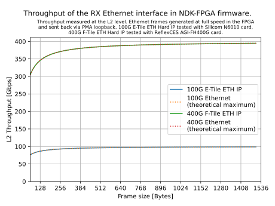
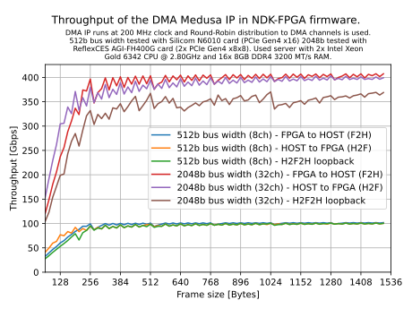
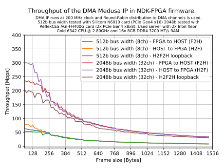
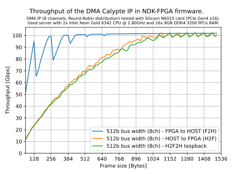
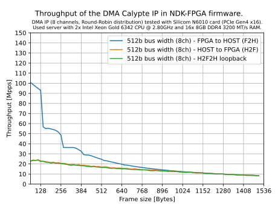

.. _ndk_performance:

Performance report
==================

The aim of this chapter is to show selected realistic performance parameters that can be achieved with the NDK framework.
We focus on the speed of the Ethernet interface for communication over the network and
on the speed of the DMA IPs (see the :ref:`DMA module docs <ndk_dma>`) for packet data transfers between the FPGA and the host server.

.. NOTE::
    The following performance values are only indicative.
    The performance can be significantly influenced by, for example,
    the used PC/server (especially the speed of the CPU, RAM, and PCIe interface)
    and also the selected card or FPGA chip.

Ethernet Interface
******************

In this test, we measure L2 throughput on the RX Ethernet interface.
A generator implemented in the FPGA is used as the source of Ethernet frames.
It generates frames of the selected size at full speed and
sends them to the TX Ethernet interface with an enabled PMA loopback to be passed back through the RX Ethernet interface.

DMA Medusa IP
*************

DMA Medusa is a closed-source DMA IP optimized for high-speed data transfers (up to 400 Gbps) and supports multiple PCIe endpoints.
The test uses multiple DMA channels and round-robin packet distribution.
The throughput test is performed in three phases:

* F2H - we measure the throughput of packet data transfers from the FPGA to the RAM of the host server; packets are generated in the FPGA.
* H2F - we measure the throughput of packet data transfers from the RAM of the host server to the FPGA; packets are generated in SW.
* H2F2H - we measure the throughput of both directions simultaneously; packets are generated in SW, received in the FPGA, passed through a loopback, and transmitted back to SW.

DMA Calypte IP
**************

DMA Calypte is an open-source DMA IP optimized for low-latency data transfers.
The test uses multiple DMA channels and round-robin packet distribution.
The throughput test is performed in three phases:

* F2H - we measure the throughput of packet data transfers from the FPGA to the RAM of the host server; packets are generated in the FPGA.
* H2F - we measure the throughput of packet data transfers from the RAM of the host server to the FPGA; packets are generated in SW.
* H2F2H - we measure the throughput of both directions simultaneously; packets are generated in SW, received in the FPGA, passed through a loopback, and transmitted back to SW.

