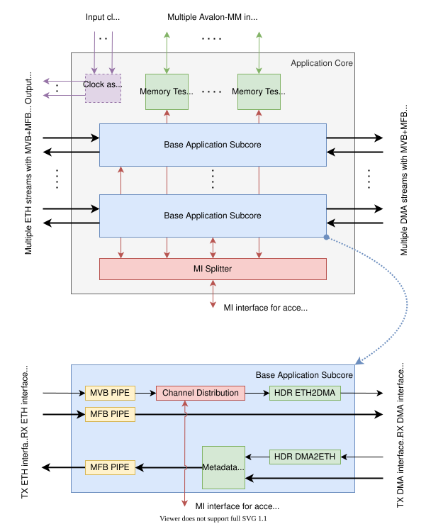

.. _ndk_app_minimal:

Minimal NDK application
=======================

The NDK-based Minimal application is a simple example of how to build an FPGA application using the NDK. It can also be a starting point for your NDK-based application. The NDK-based Minimal application does not process network packets in any way; it only sends and receives them. If the DMA IP is enabled (see the :ref:`DMA Module chapter <ndk_dma>`), then it forwards the network packets to and from the computer memory.

The top-level application provides the Ethernet, DMA, and :ref:`MI configuration bus <mi_bus>` connections to the individual APP subcore. One independent APP subcore is instantiated for each Ethernet stream. The Ethernet and DMA streams are implemented using the :ref:`MFB buses <mfb_bus>` and the :ref:`MVB buses <mvb_bus>`. The block diagram below shows the connection of the Minimal application.



.. NOTE::
    In case there is just one DMA stream and the number of ETH streams (= number of APP subcores) is more than one, the DMA Streams Merger and DMA Chan Mod modules provide the splitting/merging of the DMA streams and DMA channels for each APP subcore. In this case, the DMA channels available within the single DMA stream are evenly divided between all APP subcores.

In each subcore in the TX direction (DMA to ETH) the DMA channels are statically mapped to Ethernet channels (if there is more than one) according to the MSBs of the DMA channel number. For example, if there are 4 Ethernet channels and 32 DMA channels, the ETH channel number (2 bits) is taken from bits 4 and 3 of the DMA channel number. So packets from DMA channels 0-7 would all be routed to ETH channel 0, packets from DMA channels 8-15 would all be routed to ETH channel 1, etc.

In the RX direction (again, for each subcore), the mapping of Ethernet channels to DMA channels is configurable by the user. The mapping is performed by the :ref:`MVB Channel Router <mvb_channel_router>`. By default, each Ethernet channel has a portion of the available DMA channels to which it can send packets. And in the default state, it sends packets to the available DMA channels in  the round-robin mode.```

The Memory Testers
******************

The NDK-based Minimal application also contains :ref:`Memory Tester <mem_tester>` modules connected to external memory controllers. These modules make it easy to test the operation of external memories and measure their properties (throughput, latency). The Avalon-MM bus is used to access the external memory, see `Avalon Interface Specifications <https://www.intel.com/content/www/us/en/docs/programmable/683091/>`_.

**How to run Memory Tester:**

- The RPM package ``python3-nfb`` is required and you can obtain it from the `@CESNET/nfb-framework COPR repository <https://copr.fedorainfracloud.org/coprs/g/CESNET/nfb-framework/>`_.
- Install ``data_logger`` python package from source code using the following commands...
- ``cd <NDK-APP-XXX_root_directory>/ndk/ofm/comp/debug/data_logger/sw``
- ``python3 setup.py install --user``
- Then go to the mem tester tool directory...
- ``cd <NDK-APP-XXX_root_directory>/ndk/ofm/comp/debug/mem_tester/sw``
- Then external memory test can be run using the ``python3 mem_tester.py`` command.

**Example output of Memory Tester:**

.. code-block::

    $ python3 mem_tester.py
    || ------------------- ||
    || TEST WAS SUCCESSFUL ||
    || ------------------- ||

    Mem_logger statistics:
    ----------------------
    write requests       33554431
      write words        134217724
    read requests        33554431
      requested words    134217724
      received words     134217724
    Flow:
      write               160.78 [Gb/s]
      read                161.68 [Gb/s]
      total               161.23 [Gb/s]
    Time:
      write               427.42 [ms]
      read                425.04 [ms]
      total               852.46 [ms]
    Latency:
      min                 96.00 [ns]
      max                 555.00 [ns]
      avg                 131.56 [ns]
      histogram [ns]:
        93.4 - 117.5 ... 12613618
        117.5 - 141.6 ... 13893635
        141.6 - 165.7 ... 6618217
        503.0 - 527.1 ... 74899
        527.1 - 551.2 ... 265549
        551.2 - 575.3 ... 88513
    Errors:
      zero burst count   0
      simultaneous r+w   0
    Paralel reads count:
      min                0
      max                13
      avg                 10.83
        0.0 -   4.0 ... 4
        4.0 -   8.0 ... 27238
        8.0 -  12.0 ... 4294967295
        12.0 -  16.0 ... 13345442

.. note::

    See the :ref:`Memory Tester <mem_tester>` module documentation for a more detailed description.

The application MI offsets
**************************

In this case, the MI address space for the entire application core is divided between the individual application subcores and the wrapper of the memory testers.
The whole MI address space is described using DevTree. And its overview can be obtained by reading it from the card using the ``nfb-bus -l`` command.
For MI offsets of application core see ``/firmware/mi_pci0_bar0/application/*`` paths in example output of the command:

.. code-block::

    0x00001000: netcope,intel_sdm_controller        /firmware/mi_pci0_bar0/intel_sdm_controller
    0x00000000: cesnet,ofm,mi_test_space            /firmware/mi_pci0_bar0/mi_test_space
    0x00000800: cesnet,ofm,frequency_counter        /firmware/mi_pci0_bar0/clock_frequency_meter
    0x00002000: bittware,bmc                        /firmware/mi_pci0_bar0/boot_controller
    0x00002100: bittware,bmc                        /firmware/mi_pci0_bar0/i2c_controller
    0x00004000: netcope,tsu                         /firmware/mi_pci0_bar0/tsu
    0x0000301c:                                     /firmware/mi_pci0_bar0/pmdctrl0
    0x00800000: netcope,pcsregs                     /firmware/mi_pci0_bar0/regarr0
    0x00008000: netcope,txmac                       /firmware/mi_pci0_bar0/txmac0
    0x00008200: netcope,rxmac                       /firmware/mi_pci0_bar0/rxmac0
    0x02000000: cesnet,minimal,app_core             /firmware/mi_pci0_bar0/application/app_core_minimal_0
    0x02000000: cesnet,ofm,mvb_channel_router       /firmware/mi_pci0_bar0/application/app_core_minimal_0/rx_chan_router
    0x03000000: netcope,mem_tester                  /firmware/mi_pci0_bar0/application/mem_tester_0
    0x03040000: netcope,mem_tester                  /firmware/mi_pci0_bar0/application/mem_tester_1
    0x03080000: netcope,mem_logger                  /firmware/mi_pci0_bar0/application/mem_logger_0
    0x030c0000: netcope,mem_logger                  /firmware/mi_pci0_bar0/application/mem_logger_1
    0x00005000: cesnet,ofm,gen_loop_switch          /firmware/mi_pci0_bar0/dbg_gls0
    0x00005040: cesnet,ofm,speed_meter              /firmware/mi_pci0_bar0/dbg_gls0/l2r_tx_speed_meter
    0x00005050: cesnet,ofm,speed_meter              /firmware/mi_pci0_bar0/dbg_gls0/r2l_rx_speed_meter
    0x00005060: cesnet,ofm,speed_meter              /firmware/mi_pci0_bar0/dbg_gls0/l2r_rx_speed_meter
    0x00005070: cesnet,ofm,speed_meter              /firmware/mi_pci0_bar0/dbg_gls0/r2l_tx_speed_meter
    0x00005080: cesnet,ofm,mfb_generator            /firmware/mi_pci0_bar0/dbg_gls0/mfb_gen2dma
    0x000050c0: cesnet,ofm,mfb_generator            /firmware/mi_pci0_bar0/dbg_gls0/mfb_gen2eth
    0x01000000: netcope,dma_ctrl_ndp_rx             /firmware/mi_pci0_bar0/dma_module@0x01000000/dma_ctrl_ndp_rx0
    0x01000080: netcope,dma_ctrl_ndp_rx             /firmware/mi_pci0_bar0/dma_module@0x01000000/dma_ctrl_ndp_rx1
    0x01000100: netcope,dma_ctrl_ndp_rx             /firmware/mi_pci0_bar0/dma_module@0x01000000/dma_ctrl_ndp_rx2
    0x01000180: netcope,dma_ctrl_ndp_rx             /firmware/mi_pci0_bar0/dma_module@0x01000000/dma_ctrl_ndp_rx3
    0x01000200: netcope,dma_ctrl_ndp_rx             /firmware/mi_pci0_bar0/dma_module@0x01000000/dma_ctrl_ndp_rx4
    0x01000280: netcope,dma_ctrl_ndp_rx             /firmware/mi_pci0_bar0/dma_module@0x01000000/dma_ctrl_ndp_rx5
    0x01000300: netcope,dma_ctrl_ndp_rx             /firmware/mi_pci0_bar0/dma_module@0x01000000/dma_ctrl_ndp_rx6
    0x01000380: netcope,dma_ctrl_ndp_rx             /firmware/mi_pci0_bar0/dma_module@0x01000000/dma_ctrl_ndp_rx7
    0x01000400: netcope,dma_ctrl_ndp_rx             /firmware/mi_pci0_bar0/dma_module@0x01000000/dma_ctrl_ndp_rx8
    0x01000480: netcope,dma_ctrl_ndp_rx             /firmware/mi_pci0_bar0/dma_module@0x01000000/dma_ctrl_ndp_rx9
    0x01000500: netcope,dma_ctrl_ndp_rx             /firmware/mi_pci0_bar0/dma_module@0x01000000/dma_ctrl_ndp_rx10
    0x01000580: netcope,dma_ctrl_ndp_rx             /firmware/mi_pci0_bar0/dma_module@0x01000000/dma_ctrl_ndp_rx11
    0x01000600: netcope,dma_ctrl_ndp_rx             /firmware/mi_pci0_bar0/dma_module@0x01000000/dma_ctrl_ndp_rx12
    0x01000680: netcope,dma_ctrl_ndp_rx             /firmware/mi_pci0_bar0/dma_module@0x01000000/dma_ctrl_ndp_rx13
    0x01000700: netcope,dma_ctrl_ndp_rx             /firmware/mi_pci0_bar0/dma_module@0x01000000/dma_ctrl_ndp_rx14
    0x01000780: netcope,dma_ctrl_ndp_rx             /firmware/mi_pci0_bar0/dma_module@0x01000000/dma_ctrl_ndp_rx15
    0x01000800: netcope,dma_ctrl_ndp_rx             /firmware/mi_pci0_bar0/dma_module@0x01000000/dma_ctrl_ndp_rx16
    0x01000880: netcope,dma_ctrl_ndp_rx             /firmware/mi_pci0_bar0/dma_module@0x01000000/dma_ctrl_ndp_rx17
    0x01000900: netcope,dma_ctrl_ndp_rx             /firmware/mi_pci0_bar0/dma_module@0x01000000/dma_ctrl_ndp_rx18
    0x01000980: netcope,dma_ctrl_ndp_rx             /firmware/mi_pci0_bar0/dma_module@0x01000000/dma_ctrl_ndp_rx19
    0x01000a00: netcope,dma_ctrl_ndp_rx             /firmware/mi_pci0_bar0/dma_module@0x01000000/dma_ctrl_ndp_rx20
    0x01000a80: netcope,dma_ctrl_ndp_rx             /firmware/mi_pci0_bar0/dma_module@0x01000000/dma_ctrl_ndp_rx21
    0x01000b00: netcope,dma_ctrl_ndp_rx             /firmware/mi_pci0_bar0/dma_module@0x01000000/dma_ctrl_ndp_rx22
    0x01000b80: netcope,dma_ctrl_ndp_rx             /firmware/mi_pci0_bar0/dma_module@0x01000000/dma_ctrl_ndp_rx23
    0x01000c00: netcope,dma_ctrl_ndp_rx             /firmware/mi_pci0_bar0/dma_module@0x01000000/dma_ctrl_ndp_rx24
    0x01000c80: netcope,dma_ctrl_ndp_rx             /firmware/mi_pci0_bar0/dma_module@0x01000000/dma_ctrl_ndp_rx25
    0x01000d00: netcope,dma_ctrl_ndp_rx             /firmware/mi_pci0_bar0/dma_module@0x01000000/dma_ctrl_ndp_rx26
    0x01000d80: netcope,dma_ctrl_ndp_rx             /firmware/mi_pci0_bar0/dma_module@0x01000000/dma_ctrl_ndp_rx27
    0x01000e00: netcope,dma_ctrl_ndp_rx             /firmware/mi_pci0_bar0/dma_module@0x01000000/dma_ctrl_ndp_rx28
    0x01000e80: netcope,dma_ctrl_ndp_rx             /firmware/mi_pci0_bar0/dma_module@0x01000000/dma_ctrl_ndp_rx29
    0x01000f00: netcope,dma_ctrl_ndp_rx             /firmware/mi_pci0_bar0/dma_module@0x01000000/dma_ctrl_ndp_rx30
    0x01000f80: netcope,dma_ctrl_ndp_rx             /firmware/mi_pci0_bar0/dma_module@0x01000000/dma_ctrl_ndp_rx31
    0x01200000: netcope,dma_ctrl_ndp_tx             /firmware/mi_pci0_bar0/dma_module@0x01000000/dma_ctrl_ndp_tx0
    0x01200080: netcope,dma_ctrl_ndp_tx             /firmware/mi_pci0_bar0/dma_module@0x01000000/dma_ctrl_ndp_tx1
    0x01200100: netcope,dma_ctrl_ndp_tx             /firmware/mi_pci0_bar0/dma_module@0x01000000/dma_ctrl_ndp_tx2
    0x01200180: netcope,dma_ctrl_ndp_tx             /firmware/mi_pci0_bar0/dma_module@0x01000000/dma_ctrl_ndp_tx3
    0x01200200: netcope,dma_ctrl_ndp_tx             /firmware/mi_pci0_bar0/dma_module@0x01000000/dma_ctrl_ndp_tx4
    0x01200280: netcope,dma_ctrl_ndp_tx             /firmware/mi_pci0_bar0/dma_module@0x01000000/dma_ctrl_ndp_tx5
    0x01200300: netcope,dma_ctrl_ndp_tx             /firmware/mi_pci0_bar0/dma_module@0x01000000/dma_ctrl_ndp_tx6
    0x01200380: netcope,dma_ctrl_ndp_tx             /firmware/mi_pci0_bar0/dma_module@0x01000000/dma_ctrl_ndp_tx7
    0x01200400: netcope,dma_ctrl_ndp_tx             /firmware/mi_pci0_bar0/dma_module@0x01000000/dma_ctrl_ndp_tx8
    0x01200480: netcope,dma_ctrl_ndp_tx             /firmware/mi_pci0_bar0/dma_module@0x01000000/dma_ctrl_ndp_tx9
    0x01200500: netcope,dma_ctrl_ndp_tx             /firmware/mi_pci0_bar0/dma_module@0x01000000/dma_ctrl_ndp_tx10
    0x01200580: netcope,dma_ctrl_ndp_tx             /firmware/mi_pci0_bar0/dma_module@0x01000000/dma_ctrl_ndp_tx11
    0x01200600: netcope,dma_ctrl_ndp_tx             /firmware/mi_pci0_bar0/dma_module@0x01000000/dma_ctrl_ndp_tx12
    0x01200680: netcope,dma_ctrl_ndp_tx             /firmware/mi_pci0_bar0/dma_module@0x01000000/dma_ctrl_ndp_tx13
    0x01200700: netcope,dma_ctrl_ndp_tx             /firmware/mi_pci0_bar0/dma_module@0x01000000/dma_ctrl_ndp_tx14
    0x01200780: netcope,dma_ctrl_ndp_tx             /firmware/mi_pci0_bar0/dma_module@0x01000000/dma_ctrl_ndp_tx15
    0x01200800: netcope,dma_ctrl_ndp_tx             /firmware/mi_pci0_bar0/dma_module@0x01000000/dma_ctrl_ndp_tx16
    0x01200880: netcope,dma_ctrl_ndp_tx             /firmware/mi_pci0_bar0/dma_module@0x01000000/dma_ctrl_ndp_tx17
    0x01200900: netcope,dma_ctrl_ndp_tx             /firmware/mi_pci0_bar0/dma_module@0x01000000/dma_ctrl_ndp_tx18
    0x01200980: netcope,dma_ctrl_ndp_tx             /firmware/mi_pci0_bar0/dma_module@0x01000000/dma_ctrl_ndp_tx19
    0x01200a00: netcope,dma_ctrl_ndp_tx             /firmware/mi_pci0_bar0/dma_module@0x01000000/dma_ctrl_ndp_tx20
    0x01200a80: netcope,dma_ctrl_ndp_tx             /firmware/mi_pci0_bar0/dma_module@0x01000000/dma_ctrl_ndp_tx21
    0x01200b00: netcope,dma_ctrl_ndp_tx             /firmware/mi_pci0_bar0/dma_module@0x01000000/dma_ctrl_ndp_tx22
    0x01200b80: netcope,dma_ctrl_ndp_tx             /firmware/mi_pci0_bar0/dma_module@0x01000000/dma_ctrl_ndp_tx23
    0x01200c00: netcope,dma_ctrl_ndp_tx             /firmware/mi_pci0_bar0/dma_module@0x01000000/dma_ctrl_ndp_tx24
    0x01200c80: netcope,dma_ctrl_ndp_tx             /firmware/mi_pci0_bar0/dma_module@0x01000000/dma_ctrl_ndp_tx25
    0x01200d00: netcope,dma_ctrl_ndp_tx             /firmware/mi_pci0_bar0/dma_module@0x01000000/dma_ctrl_ndp_tx26
    0x01200d80: netcope,dma_ctrl_ndp_tx             /firmware/mi_pci0_bar0/dma_module@0x01000000/dma_ctrl_ndp_tx27
    0x01200e00: netcope,dma_ctrl_ndp_tx             /firmware/mi_pci0_bar0/dma_module@0x01000000/dma_ctrl_ndp_tx28
    0x01200e80: netcope,dma_ctrl_ndp_tx             /firmware/mi_pci0_bar0/dma_module@0x01000000/dma_ctrl_ndp_tx29
    0x01200f00: netcope,dma_ctrl_ndp_tx             /firmware/mi_pci0_bar0/dma_module@0x01000000/dma_ctrl_ndp_tx30
    0x01200f80: netcope,dma_ctrl_ndp_tx             /firmware/mi_pci0_bar0/dma_module@0x01000000/dma_ctrl_ndp_tx31
