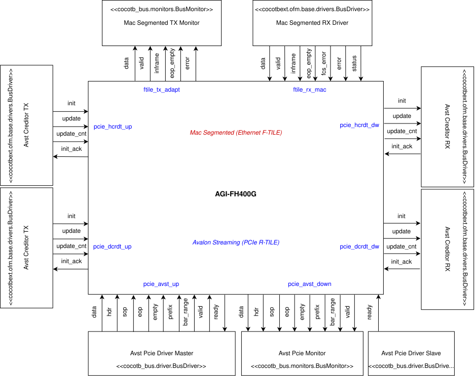
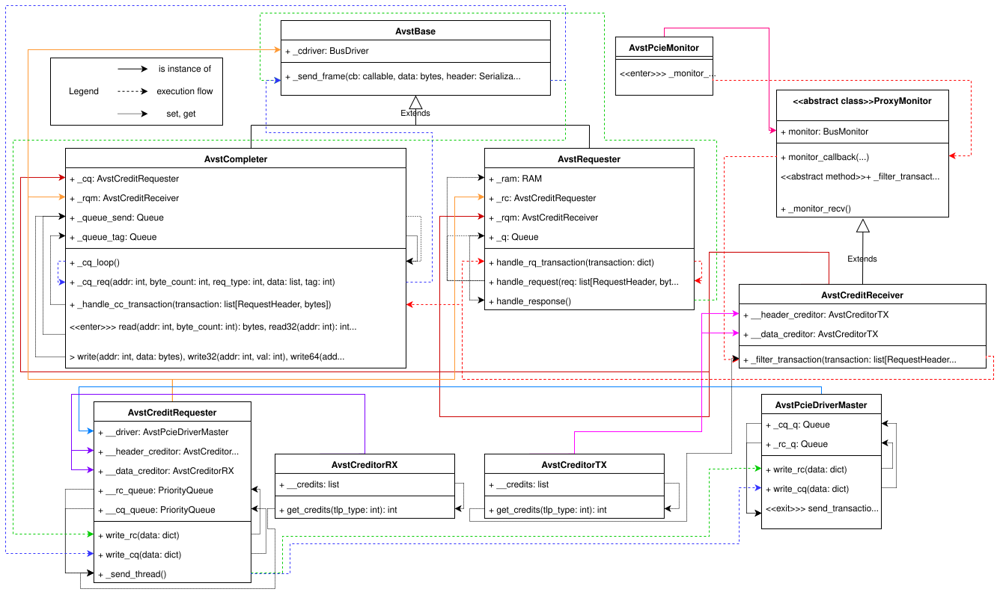

===============================================
Top-Level Simulation using cocotb/cocotbext-ndk
===============================================

NDK-FPGA also includes a top-level simulation for running tests on the whole firmware of FPGA cards. It is implemented using
**Python** and the ``cocotb`` framework. Some parts of ``cocotb`` were also modified and extended by us to better fit our use cases, creating
the ``cocotbext-ndk`` package. If you want to discover more about ``cocotbext-ndk``, refer to :ref:`its chapter <cocotbext-ndk>`.

Requirements
============

**Python version 3.11** and higher, **Intel Quartus Prime Pro** or **AMD Vivado**, and **Questa Sim** are required.

Cloning `ndk-fpga` from GitHub with all its dependencies is also required. You can achieve this using the following command:

.. code-block:: bash

    git clone --recurse-submodules https://github.com/CESNET/ndk-fpga.git

.. warning:: Some submodules are internal to CESNET and may not be accessible for cloning by unauthorized users.

How to run
==========

Locate the `ndk-fpga` repository. Then use the following command to change into the simulation's location:

.. code-block:: bash

    cd ndk-fpga/apps/minimal/tests/cocotb

Use the **prepare.sh** script which automatically creates a **Python virtual environment** with all the dependencies:

.. code-block:: bash

    make cocotb-venv

After the script is finished, enter the newly created virtual environment:

.. code-block:: bash

    source venv-fpga/bin/activate

Then run the simulation using the included **Makefile**. You can also specify the card that shall be simulated.
Selection of the simulated card is performed with the environment variable **CARD**:

.. code-block:: bash

    make CARD=...

.. note:: Source files used to run the simulation of all cards can be found in ``ndk-fpga/apps/minimal/build``. To find out which
    cards are supported, refer to **NFBDevice** in ``ndk-fpga/core/cocotb/ndk_core/nfbdevice.py``.

Architecture
============

Now let's do a deep dive into what the top-level simulation is used for and how it actually functions.

A top-level simulation is used for a simple software verification of the entire `FPGA` firmware of network cards. This allows for
debugging their functionality before actual deployment. It tests several basic operations on the network card: writing to and reading
from the **MI interface**, activating the **RX MAC** and checking its status, measuring the frequency of clock signals, and sending and
receiving packets through the entire design. It's designed to be as universal and easily modifiable as possible to support additional
network cards.

The specifics of individual network cards are configured using the **NFBDevice class** (found in ``ndk-fpga/core/cocotb/ndk_core/nfbdevice.py``).
This includes, among other things, starting the necessary clocks and initializing the **Ethernet** and **PCIe** interface drivers and monitors.
These are then used by the tests to send input data to and read output data from the network card. Each card has pre-defined frequencies for clock
signals and the simulation selects the appropriate ones according to the simulated CARD. The card's design conditionally selects drivers and
monitors based on individual signals it contains. These approaches give the **NFBDevice** module considerable
versatility, reduce redundancy, and allow to easily extend the list of supported cards in the future.

Several **PCIe** and **Ethernet** interfaces are supported. For **PCIe**, both **Axi4 Stream** and
**Avalon Streaming for PCI Express** can be used. In the case of
the **Avalon Streaming** bus, two variants for two Hard IPs are supported: the older **P-Tile** and the newer **R-Tile** (adds a credit interface). In the area of **Ethernet interfaces**, modules enabling the use of **LBus** (CMAC hard IP), **Avalon Streaming for Ethernet (E-Tile)**, and
**MAC Segmented (F-Tile)** are implemented. Due to the support for many cards and interfaces, the **AGI-FH400G** card will be used to describe the top-level simulation.

====

   AGI-FH400G Card Firmware Simulation Block Diagram.

The block diagram above illustrates the connection of individual drivers and monitors used in the simulation to specific hardware design
signals. Drivers typically inherit from the **BusDriver** class, either from the `cocotb_bus` package (one of the packages provided by
`cocotb`) or from the identically named class in the `cocotbext-ndk` package. Monitors inherit from the **BusMonitor**
class from the `cocotb_bus` package. The diagram illustrates the inheritance hierarchy by displaying each object's parent class in its
respective header. Monitors can only read signal values and report them. Drivers can both read from and write to signals. The interaction
method between an object and a specific signal is shown by arrows between them: an arrow from a driver to the card means the signal's value
is modified by the driver and read by the card. Conversely, an arrow from the card to a driver or monitor indicates that the signal is controlled
by the card and is read by the connected object.

Typically, **PCIe** and **Ethernet** interface signals are set and read during verification. This specific card uses the **PCIe R-Tile hard IP** with the **Avalon Streaming** interface and associated credit interface; individual signal groups of this interface are
shown in blue. The **Ethernet F-Tile hard IP** uses the **MAC Segmented** interface, which is marked in red.

====

    Class Diagram for Controlling the Simulated R-Tile PCIe Avalon-ST Interface

However, the simulation architecture is usually much more complex than simply setting and reading signals, with many layers between the
test and the simulated hardware. A great example, in the case of the **AGI-FH400G**, is the control of the **Avalon Streaming**
bus. The objects that are an integral part of it and their interactions are shown in the class diagram above. The diagram displays individual
classes with their attributes and methods. There are four types of relationships between classes, indicated by arrows:

* A solid arrow with a transparent arrowhead and the description `extend` signifies class inheritance.
* A solid arrow with a filled arrowhead means that the attribute pointed to by the arrow is an instance of the class from which the arrow originates.
* A dashed arrow indicates the simulation flow, i.e., the order of method calls. The method from which the arrow originates typically calls the method it points to after completing its operation.
* A dotted line signifies either an interaction between a method and an attribute, or another method. An arrow from a method to an attribute indicates that the method modifies the attribute's value (e.g., adding an item to a queue). If the arrow goes in the opposite direction, it means the method reads the attribute and performs an action based on its value (e.g., if a new transaction appears in the queue, the method that was waiting for it calls another method to process the transaction). The meaning of this relationship between two methods is that the execution of the method pointed to by the arrow is influenced by the value returned by the method from which the arrow originates (e.g., the ``_send_thread`` method of the **AvstCreditRequester** class calls the next method only if the ``get_credits`` method of the **AvstCreditorRX** class returns a sufficiently large number indicating the number of available credits).

Additionally, some methods may have ``<<enter>>`` and ``<<exit>>`` decorators, indicating entry into and exit from the diagram. These are
either classes that write or read transactions to or from hardware signals as shown in the diagram, or they are functions called by an
external class not shown in the diagram, usually tests.

The first entry is the ``_monitor_recv()`` method of the **AvstPcieMonitor** monitor, with the path shown in red. If the ``ready`` signal
of the ``pcie_avst_down`` signal group is active and the card has data it wants to send via the **Avalon Streaming** interface, it writes
it to the signals of this group. The **AvstPcieMonitor** monitor is connected to these, which reads the signal values and constructs a
transaction from them, sending it further using a callback. This callback invokes the method linked to it. In the **R-Tile** variant, which
has a credit interface used to control the amount of data passing through the bus to prevent overload, the callback is connected to the
``monitor_callback`` method of the class that **AvstCreditReceiver** inherits from the base class **ProxyMonitor**. This immediately passes
the transaction to the ``_filter_transaction`` method of the same object. This then uses the ``get_credits`` method of the **AvstCreditorTX**
class, accessed via its ``__header_creditor`` and ``__data_creditor`` attributes, to check the number of credits available to the card,
thus limiting the number of transactions that can be sent by the card. If there are not enough credits, an exception is raised, indicating that the
card did not respect the credit limit. Otherwise, credits are used, and the transaction proceeds to two methods simultaneously:
``_handle_cc_transaction`` of the **AvstCompleter** class and ``handle_rq_transaction`` of the **AvstRequester** class. Here, the type
of transaction is evaluated. If it's a completion, it's processed by the ``_handle_cc_transaction`` method, and its tag is stored in
the ``_queue_tag`` queue. The ``handle_rq_transaction`` method discards its copy. If it's a request, **AvstCompleter** ignores it, and
**AvstRequester** passes it to its ``handle_request`` method, which examines whether it's a write request or a read request. In the case of
a write, data is written to memory, accessed via the ``_ram`` attribute. Otherwise, data is read from memory, and the result is appended to
the ``_q`` queue. If the ``handle_response`` method finds data in the ``_q`` queue, another program flow begins, shown in green. The data
is passed to the ``_send_frame`` method of the same class, which constructs a frame from it. This is then moved to the ``write_rc`` method of the
**AvstCreditRequester** class, which writes it to its ``__rc_queue``. Once the transaction's turn comes, it's taken out of the queue
by the ``_send_thread`` method, where it waits until, based on the result of the **AvstCreditorRX** object's ``get_credits``, there
are enough credits for it to be sent. If there are not enough credits, the transaction waits until the card returns enough credits
to allow the transfer. Then, the transaction is passed to the ``write_rc`` method of the **AvstPcieDriverMaster** driver, which writes
it to its ``_rc_q`` queue, from where it is later read by the ``send_transaction`` method and written to the ``pcie_avst_up`` signals
of the network card.

The second input to the diagram consists of the methods ``read``, ``write``, and their variants of the **AvstCompleter** class. This
path is marked in blue. The passed data is written to the ``_queue_send`` queue. From there, it is then read by the ``_cq_loop`` method,
which passes it to ``_cq_req`` of the same object, where a frame is constructed from the data. This is sent using the ``_send_frame``
function to another object, **AvstCreditRequester**, which receives it via the ``write_cq`` method. This method adds the packet to
``cq_queue``, and it is processed and sent in the same manner described previously.

====

All previously mentioned parts of the simulation are then utilized by the tests performed on the network card. To date, there are
five tests in total:

* **test_mi_access_unaligned**: Verifies writing to and reading from card memory using the **MI interface**. Requests are sent using the ``read`` and ``write`` methods of the **AvstCompleter** object.
* **test_enable_rxmac_and_check_status**: Activates the **RX MAC** of the **Ethernet interface** and attempts to read the card's status.
* **test_frequency_meter**: Measures the frequency of selected (in the FPGA FW) clock signals.
* **test_ndp_recvmsg**: Sends a packet onto the **Ethernet** interface via the **Mac Segmented RX Driver**. The packet is then received on **PCIe** interface by the **Avst PCIe Monitor** and compared with the sent packet for evaluation of the RX datapath.
* **test_ndp_send_msgs**: Sends a packet through **PCIe** via the **Avst Pcie Driver Master**. The packet is then received on the **Ethernet interface** by the **Mac Segmented TX Monitor** and compared with the sent packet. This test internally runs ``_test_ndp_sendmsg`` twice (which sends and receives one packet each) and ``_test_ndp_sendmsg_burst`` once (which sends and receives several packets).

====

The implemented simulation provides all the necessary means for connecting to **software layers**. It offers access to
**firmware registers** via ``read`` and ``write`` methods, and also supports **DMA communication** utilizing direct `RAM`
access. Simultaneously, the **entire network card firmware is simulated**, which opens up the possibility of integrating
complex software layers like **DPDK**.
